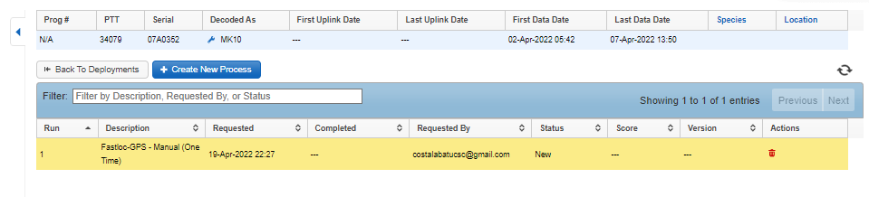

# **STEP 00. Organize Metadata**

* **00.A.**   Notes  & Sleep_Study_Metadata 
* **00.B.**    Location Data Processing
* **00.C.**    Video Scoring  

Input data:

1. **00_Sleep_Study_Metadata.xlsx** - Metadata for all studies
2. **00_Ethogram.xlsx** - Ethograms
3. testNN_Nickname_**00_Notes.xlsx** - Original data entered in Excel
4. testNN_Nickname_**00_VideoScoringData** - Video Scoring Data

Output Data: 

1. **01_Sleep_Study_Metadata.csv** - Long format metadata for all animals
2. testNN_Nickname_**00_Metadata.csv** - Metadata for single animal

## **STEP 00.A**. Notes & Metadata
1.  **Overview:** Enter metadata manually and then transform metadata
    into long format CSV (less readable but more ideal across
    programming languages)

    1.  Script:
        
        **00_Metadata.R**
        **\***

    2.  Input:
        **00_Sleep_Study_Metadata.csv**

    3.  **Output:
        testNN_Nickname_00_Metadata.csv**
        for each seal

    4.  **Output 2:
        01_Sleep_Study_Metadata.csv**
        **–** Long format metadata for use in other programs

    5.  Save **00_Sleep_Study_Metadata.xlsx**
         with necessary fields filled in
        (see Tagging Protocol for more lab-specific information) as
        **00_Sleep_Study_Metadata.csv**
        **.**

    6.  **Run** Script:
        
        **00_Metadata.R**
        **\* Use RStudio to open** 🗀 Sleep_Analysis\> Sleep_Analysis.Rproj (if you don’t have it; install R and RStudio first)

        1.  **Will save:
            01_Sleep_Study_Metadata.csv**
            in Data folder for subsequent steps.

## **00.B.**    Location Data Processing

1.  **Overview:** Use [Wildlife Computers Data
    Portal](https://my.wildlifecomputers.com/data/) to process GPS data.

    1.  **Scripts:** None; manual. Must wait until file processes to
        download processed CSVs.

    2.  **Input:** testNN_Nickname_01_TAGSERIAL.wch (Wildlife Computers
        file)

    3.  **Output:** testNN_Nickname_01_GPShits.csv
        testNN_Nickname_01_GPShits_UserModified.xlsx

2.  **Important steps:** Upload data into data portal, add metadata
    (including start and stop date/times and latitude/longitudes), then
    begin Location Processing by “Creating New Process” below.

## **00.C.**    Video Scoring  

1.  **Overview:** Video data is scored and turned into an Ethogram to be
    paired with motion/environmental sensor data and sleep data.

    1.  **Scripts:**
        
        **00_Ethograms.R**
        

    2.  **Input:** Scored data output from
        
        **BORIS** Behavioral Scoring software:  
        filename:
        testNN_Nickname_CameraType_StartYearMonthDay_StartTime-EndYearMonthDay_EndTime.csv  
        example:
        
        test20_SnoozySuzy_DryWebcam_20200421_105230-20200423_142530.csv

    3.  **Output:**
        
        testNN_Nickname_00_VideoScoringData.csv

2.  On a parallel timeline with sleep processing, video files are scored
    by trained experts. Detailed steps, tutorials, and presentations can
    be found in 🗀 **Scripts \>** 🗀 **00_Video Scoring Materials**. These
    steps include:

    1.  **Create a copy of video files** on Google Drive (🗀
        Sleep_Analysis \> 🗀 Video Footage \> 🗀 testNN_Nickname_Video \>
        🗀 Camera type (e.g. Dry Recording Webcam for land webcam
        recording; Wet Recording Webcam for pool webcam recording; or
        High Resolution DSLR Videos)

    2.  **Rename video files** with systematic names, following naming
        convention such that all files from a single camera can be
        stored in the same folder:

        1.  **Webcam:** 2019102515 (43).mp4 (25-Oct-2019 15:43:00 –
            15:43:59)

        2.  **DSLR or GoPro:** 10_27_2019\_\_\_16_08_00.MP4 (27-Oct-2019
            16:08:00 – end time)

        3.  **BBC Animal-Borne Camera:** 20200412_110730.MP4
            (12-Apr-2020 11:07:30)

    3.  Score video files using
        BORIS
        ([download here](https://boris.readthedocs.io/en/latest/)) using
        the Boris Project File (🗀 Sleep_Analysis \> 🗀 Scripts \>
        **00_BorisProject.boris**
        )
        and according to the **00_Ethogram.xlsx** (this file also stores
        output for Machine Learning Model Runs with files like
        testNN_Nickname_03_VideoMotionData_25Hz.csv):  
        