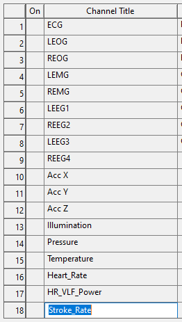
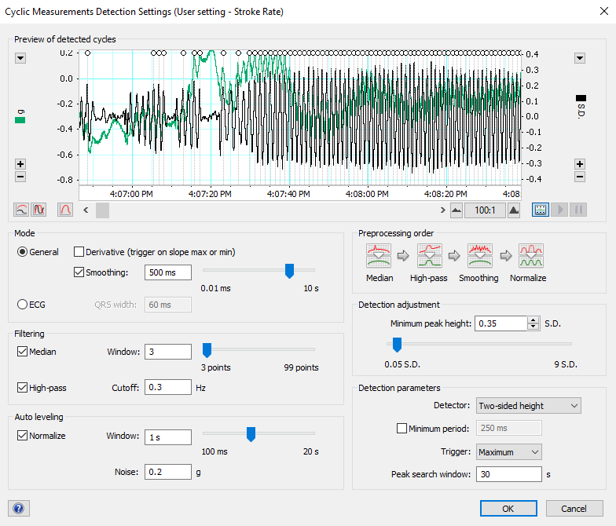
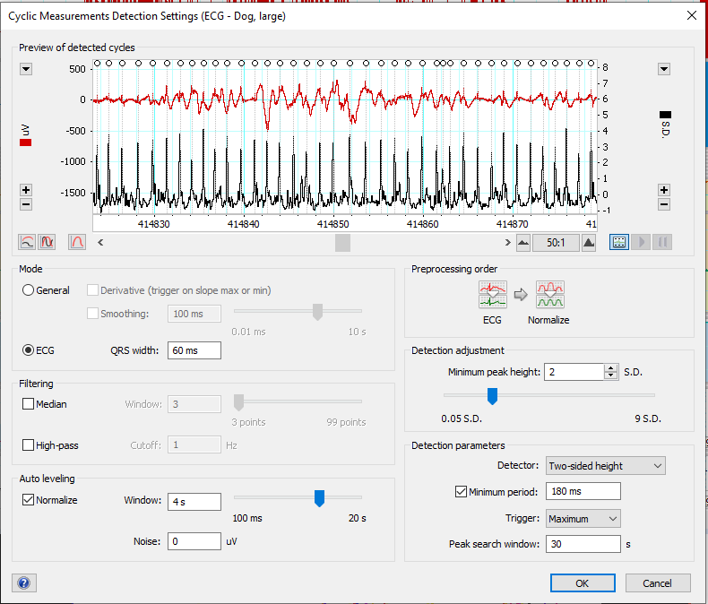
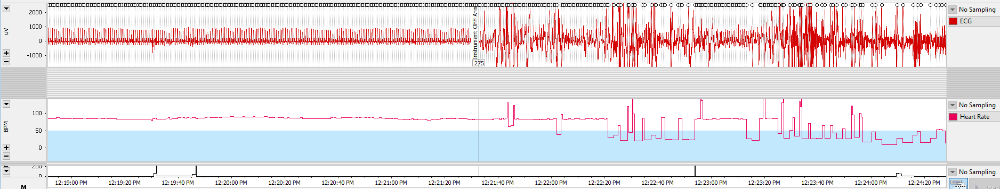
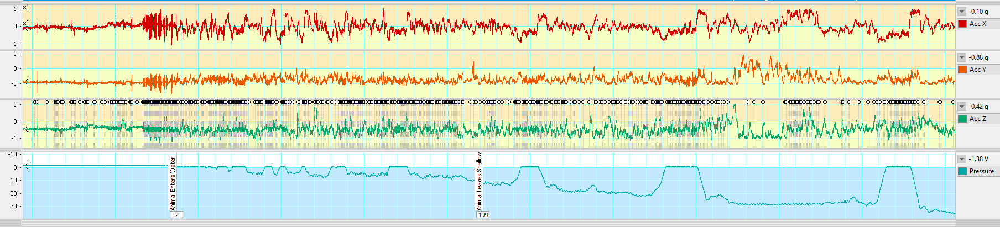
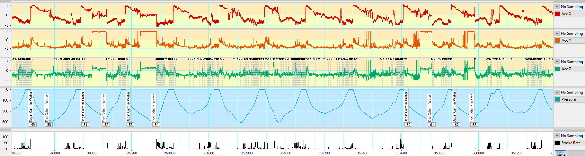
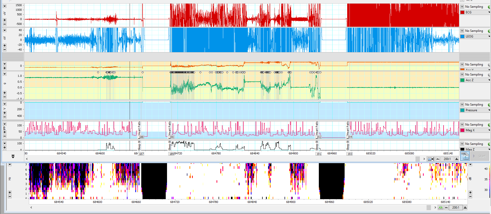

# Convert & Visualize Raw Data

* **01.A.**     Download and convert data 
* **01.B.**  Rearrange EDF 
* **01.C.**   Visualize Raw Data in LabChart 
* **01.D.**   Raw Scoring 

## * **01.A.**     Download and convert data 

1.  Overview:

    1.  **Script:**
          **GUI through**
        Matlab app (Neurologger3ConverterAndVisualizer.exe
        )

    2.  **Input:** testNN_Nickname_01_ALL.dat - Binary data straight
        from the tag

    3.  **Output:** testNN_Nickname_01_ALL.edf - Converted EDF file with
        all data

2.  Plug memory card into the USB microSD card reader.

3.  **Read data:**

    1.  Open “ReadDisk.exe” utility. 

    2.  Allow the application to make changes, but DO NOT format the
        drive.

    3.  Make copies of binary file “.dat” in “Data” folder in Documents,
        on external drive, AND Google Drive folder.

    4.  **Output:** testNN_Nickname_01_ALL.dat - Binary data straight
        from the tag

4.  **Convert data:**

    1.  Open Neurologger3Converter&Visualizer MATLAB App
        (C:\Users\Jessie\Documents\Dissertation Sleep\Neurologger
        Software
        2021\Neurologger3ConverterVisualizer_2021-05-15\Neurologger3Converter&Visualizer\for_redistribution_files_only\Neurologger3ConverterAndVisualizer.exe
        

    2.  Open Configuration – default script configuration is
        “Int32ch250Hz_I2C36Hz_IR8K_IPT_eSD”

    3.  Open “.dat” binary file, press “Convert” to EDF file (using
        start time from Real-Time Clock and “Insert Restart Delays”).

5.  **Wait & monitor computer performance.** Open the task manager to
    keep track of how much memory this task is requiring of your
    computer. This will take \~30-40 GB of Memory for a \~10-day file.
    You could convert data in chunks but start times must be manually
    entered for each section and that may introduce data synchronization
    issues.

## **01.B.**  Rearrange EDF 

1.  **Overview:**
    Processing step 01.B rearranges EDF in EDF Browser
    
    ([download here](https://www.teuniz.net/edfbrowser/index.html)) to
    achieve standardized channel configuration in LabChart
    . Open signals from
    original EDF (output in step above) and add them to a new file in
    the order shown to the right:  

    **Channel configuration:**

|     |                 |             |        |
|-----|-----------------|-------------|--------|
|     |                 | upside_down | normal |
| 1   | GyrX            |             |        |
| 2   | GyrY            |             |        |
| 3   | GyrZ            |             |        |
| 4   | AccX            |             |        |
| 5   | AccY            |             |        |
| 6   | AccZ            |             |        |
| 7   | MagX            |             |        |
| 8   | MagY            |             |        |
| 9   | MagZ            |             |        |
| 10  | Illumination    |             |        |
| 11  | Pressure        |             |        |
| 12  | Temperature     |             |        |
| 13  | Synchronization |             |        |
| 14  | Ch1             | LEMG        | ECG    |
| 15  | Ch2             | REOG        | LEOG   |
| 16  | Ch3             | LEOG        | REOG   |
| 17  | Ch4             | REMG        | LEEG1  |
| 18  | Ch5             | LEMG        | ECG    |
| 19  | Ch6             | ECG         | LEMG   |
| 20  | Ch7             | LEEG1       | REMG   |
| 21  | Ch8             | REEG2       | REEG2  |
| 22  | Ch9             | LEMG        | ECG    |
| 23  | Ch10            | REOG        | LEOG   |
| 24  | Ch11            | LEOG        | REOG   |
| 25  | Ch12            | LEEG3       | LEEG3  |
| 26  | Ch13            | LEMG        | ECG    |
| 27  | Ch14            | ECG         | LEMG   |
| 28  | Ch15            | LEEG1       | REMG   |
| 29  | Ch16            | REEG4       | REEG4  |

1.  **Script:**
    None; manual

2.  **Input:**
    testNN_Nickname_01_ALL.edf -
    Converted EDF file with all data

3.  **Output:** ***testNN_Nickname_01_ALL_Rearranged.edf***
    –
    Rearranged & Named EDF file with ECG, LEOG, REOG, LEMG, REMG, LEEG1,
    REEG2, LEEG3, REEG4, AccX, AccY, AccZ, Illum, Pressure, Temp, MagX,
    MagY (placeholders for HR/SR calculation)

    1.  **Note:** Default units for pressure are in bars. After Motion &
        Environmental processing, units for Depth will be in meters.

## **01.C.**   Visualize Raw Data in LabChart 

1.  **Overview**: Processing Step 01.C Appends rearranged EDF file
    generated in “Rearrange EDF” step above (filename below) and adds
    settings to view the resulting file in LabChart:

    1.  **Script**: None; manual.

    2.  **Input:** testNN_Nickname_01_ALL_Rearranged.edf
        –
        Rearranged & Named EDF file

    3.  **Output:** testNN_Nickname_01_ALL_Raw.adicht
        - LabChart file with
        unprocessed data

2.  Visualize raw electrophysiological and motion/environmental signals
    to preview data and manually identify animal behavior and location
    (calm in water; enter/exit water)

3.  Open LabChart settings file: 🗀 Sleep_Analysis \> 🗀 Scripts \>
    **01_Raw_Settings.adiset** 

4.  **File\> Append** Rearranged EDF file
    
    generated in previous step.

    

5.  Settings file will add peak detection for Heart Rate and Stroke
    Rate  
    

    1.  Settings used for cyclical peak detection using Accelerometer  
        

    2.  Settings used for cyclical peak detection using ECG signal  
        

###  Process Raw Data in LabChart 

1)  Remove transmitter pings using LabChart:

    1.  Method from:
        [adinstruments.com/support/videos/labchart-mastery-removing-ecg-artifacts-emg-data](adinstruments.com/support/videos/labchart-mastery-removing-ecg-artifacts-emg-data)

    2.  Using two arithmetic channels:

        1.  First one:
            `abs(Threshold(SmoothSec(Window(Ch1,-500,500),3),1))\*Bandpass(Ch1,0.3,75)`

            1.  Window function makes anything within the given range
                (-500 to +500 uV – units must be specified) = 1; if it
                exceeds that range, the value is changed to 0

            2.  SmoothSec widens this gap slightly, smooths the area so
                that you can get rid of 0 values where the channel
                passes back through the window briefly.

            3.  Threshold creates sharp edges again to be used to delete
                the data in the wider window

            4.  Abs()\*Bandpass() then removes any data where the value
                in the first channel is 0 and where it is one, it keeps
                the bandpass filtered values from Ch1.

        2.  Second channel:
            `Shift(Shift(Threshold(0.9999,SmoothSec(Window(Ch1,-500,500),3)),-5)\*abs(Threshold(SmoothSec(Window(Ch1,-500,500),3),1))\*Bandpass(Ch1,0.3,75),5)`

            1.  Threshold makes it so that the data is 1 wherever it
                deleted data from Ch1 and 0 everywhere else.

            2.  Shift shifts this square pulse backwards by 5 seconds.

            3.  Multiplying back the equation from the first bullet
                points replaces all 1s with data from Ch1

            4.  Shifting it forward by 5 seconds shifts the data so that
                it fits the gap.

    3.  Finally, add the two together:
        `Shift(Shift(Threshold(0.9999,SmoothSec(Window(Ch1,-500,500),3)),-5)\*abs(Threshold(SmoothSec(Window(Ch1,-500,500),3),1))\*Bandpass(Ch1,0.3,75),5) +
        abs(Threshold(SmoothSec(Window(Ch1,-500,500),3),1))\*Bandpass(Ch1,0.3,75)`

    4.  All in one:

        1.  ECG:
            `Shift(Shift(Threshold(0.9999,SmoothSec(Window(Ch1,-1500,1500),3)),-5)\*abs(Threshold(SmoothSec(Window(Ch1,-1500,1500),3),1))\*Bandpass(Ch1,0.3,75),5) +
            abs(Threshold(SmoothSec(Window(Ch1,-1500,1500),3),1))\*Bandpass(Ch1,0.3,75)`

            1.  Chose -1500 to +1500 to filter out only largest
                artifacts- does not remove all transmitted signal but
                removes less of high artifact signals.

        2.  L EOG:
            `Shift(Shift(Threshold(0.9999,SmoothSec(Window(Ch2,-800,800),6)),-8)\*abs(Threshold(SmoothSec(Window(Ch2,-800,800),3),1))\*Bandpass(Ch2,0.3,35),8) +
            abs(Threshold(SmoothSec(Window(Ch2,-800,800),6),1))\*Bandpass(Ch2,0.3,35)`

            1.  Chose -800 to +800 to filter out only largest artifacts-
                some clipping but EOG channel not critical for scoring

        3.  L EMG:
            `Shift(Shift(Threshold(0.9999,SmoothSec(Window(Ch4,-500,500),6)),-8)\*abs(Threshold(SmoothSec(Window(Ch4,-500,500),3),1))\*Bandpass(Ch4,10,100),8) +
            abs(Threshold(SmoothSec(Window(Ch4,-500,500),6),1))\*Bandpass(Ch4,10,100)`

        4.  EEG (all):
            `Shift(Shift(Threshold(0.9999,SmoothSec(Window(Ch6,-500,500),6)),-8)\*abs(Threshold(SmoothSec(Window(Ch6,-500,500),3),1))\*Bandpass(Ch6,0.3,35),8) +
            abs(Threshold(SmoothSec(Window(Ch6,-500,500),6),1))\*Bandpass(Ch6,0.3,35)`

## **01.D.**   Raw Scoring 

1.  **Overview**: Processing Step 01.D identifies critical time points
    and provides a first look at the quality and scope of the data.

    1.  **Script:**
         None; manual

    2.  **Input:** testNN_Nickname_01_ALL_Raw.adicht
         - LabChart file with
        unprocessed data

    3.  **Output:** testNN_Nickname_01_ALL_Raw_SCORED.adicht
         - LabChart file with
        scored water entry/exits

    4.  **Output 2:** 00_Raw_Scoring_Metadata.xlsx

        1.  **Copy/paste comments from Raw_SCORED** LabChart file into
            Excel spreadsheet, insert Seal ID (testNN_Nickname). Export
            as **00_Raw_Scoring_Metadata.csv** for use in:
            **06_Hypnograms.R** in Processing Step 06.

2.  Identify recording start and end:

    1.  **Instrument ON Animal:** First sign of heart rate in ECG
        (instrument attached to animal)  
        

    2.  **Instrument OFF Animal:** Last sign of heart rate in ECG
        (instrument removed)  
        

    3.  \***NOTE:** The exact position of these timestamps is not
        critical, but these timestamps will be used to TRIM the data
        file in later processing steps, so keep their position
        consistent across files. Enter these ON.ANIMAL and OFF.ANIMAL
        Date Times in **“00_Sleep_Study_Metadata.xlsx”.**

3.  **Identify animal location**  
    LAND v. SHALLOW WATER v. CONTINENTAL SHELF v. OPEN OCEAN

    1.  **Animal Enters Water:** Animal enters water (defined by
        accelerometer motion and increase in pressure) *LAND -\> SHALLOW
        WATER*

    2.  **Animal Leaves Shallow Water:** Animal enters water \>10 m.
        *SHALLOW WATER -\> CONTINENTAL SHELF  
        *

    3.  **Animal Leaves Continental Shelf Water:** Animal enters water
        \>\~200 m (no longer is following the benthic contour).
        *CONTINENTAL SHELF -\> OPEN OCEAN  
        *

    4.  **Animal Returns to Continental Shelf Water:** Animal returns to
        water \<\~200 m (returns to following benthic contour). *OPEN
        OCEAN -\> CONTINENTAL SHELF  
        *

    5.  **Animal Returns to Shallow Water:** Animal returns to water
        \<\~10 m (returns to following benthic contour). *CONTINENTAL
        SHELF -\> SHALLOW WATER  
        *

    6.  **Animal Exits Water:** Animal exits water (defined by
        accelerometer flattening and pressure) *SHALLOW WATER -\> LAND  
        *

4.  **Identify calm segments** in water without motion artifacts that
    might be useful for ICA analysis and/or contain sleep segments.

    1.  **Begin Calm in Water:** beginning of non-stroking segment in
        water

    2.  **End Calm in Water:** end of non-stroking segment in water  
        

    3.  **NOTE:** Stroke identification is based on unprocessed
        accelerometer data- not quite as good as with processed
        Gyroscope data in later Processing Step 06.

5.  **Identify logger restarts** where data is not available

    1.  Sleep State Unscorable & Heart Patterns Unscorable: at beginning
        of restart

    2.  Sleep State Unscorable & Heart Patterns Unscorable: at beginning
        of restart  
        

    3.  **Note:** These comments are for your reference only, these
        comments will be most important in the Step 06 Sleep Scoring
        file, which dictates the “Unscorable” sections of the Hypnogram.