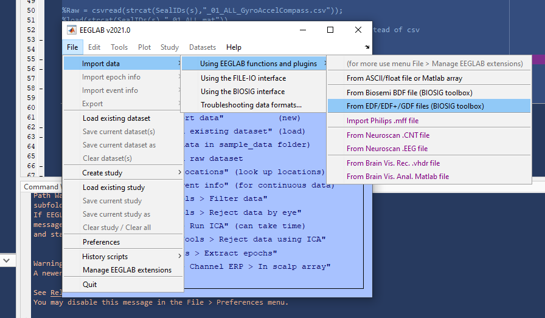
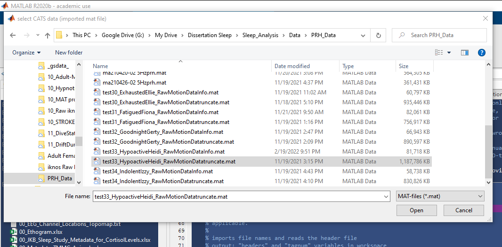
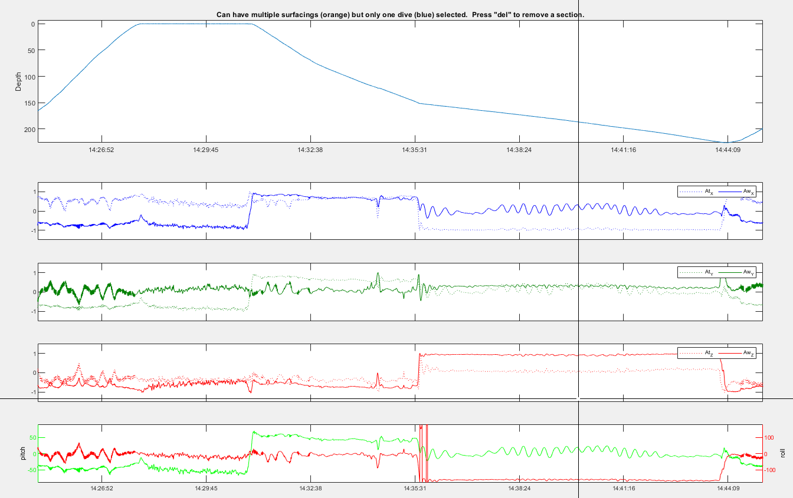
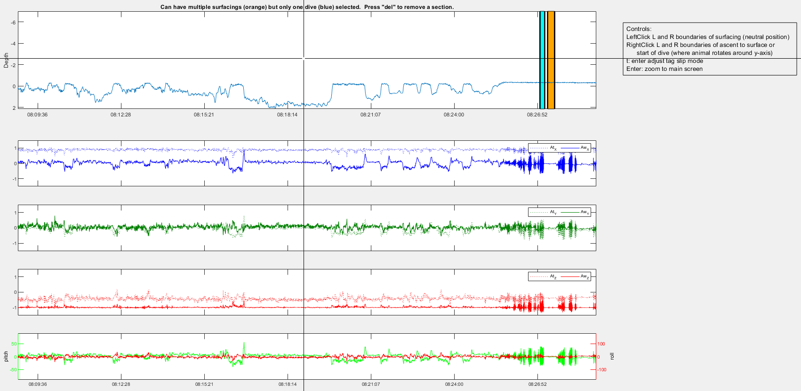

# **STEP 02. Process Motion Sensor Data**

*Scripts:* `02_ProcessingMotionEnvSensors.m` & [`CATS Toolbox`](https://github.com/wgough/CATS-Methods-Materials)

> Cade, D.E., Gough, W.T., Czapanskiy, M.F. et al. Tools for integrating inertial sensor data with video bio-loggers, including estimation of animal orientation, motion, and position. *Anim Biotelemetry* **9**, 34 (2021). https://doi.org/10.1186/s40317-021-00256-w

*Input:* Raw motion & environmental sensor data

* **02.A.**  [Read in Metadata]()
* **02.B.**  Load Motion & Environmental Data 
* **02.C.**  Resample Data
* **02.D.**  MAT File setup for CATS Toolbox
* **02.E.**    Run [`CATS Toolbox`](https://github.com/wgough/CATS-Methods-Materials)
* **02.F.**  Save Calibrated & Processed Data

###   Processing Motion & Environmental Sensors

MATLAB v2020b: 🗀 Sleep_Analysis \> 🗀 Scripts \>
02_ProcessingMotionEnvSensors.m 

The script 02_ProcessingMotionEnvSensors.m
 refers to sections in the
CATS Toolbox’s MainPRHTool.m
(<https://github.com/wgough/CATS-Methods-Materials>) which should be run
simultaneously. We have made slight changes to the original code to work
with our study system (available as MainPRHTool_JKB.m)

1.  **Overview:** Script resamples Motion & Environmental Sensor data
    from 250/7 to desired sample rate (25Hz), calibrates depth,
    accelerometer, and magnetometer signals to get pitch, roll, and
    heading.

**Import data from EDF:** Use EEGLAB

## **02.A.**  [Read in Metadata]()

1.  **Overview**: Processing Step 02.A reads in seal metadata, converts
    to usable MATLAB formats and stores important variables.

    1.  **Script:**
        
        02_ProcessingMotionEnvSensors.m Section 02.A

    2.  **Input:**
        **01_Sleep_Study_Metadata.csv**
        from **00_Metadata.R**

    3.  **Output:** MATLAB variables for subsequent steps

## **02.B.**  Load Motion & Environmental Data 

1.  **Overview:** Processing Step 02.B reads in motion & environmental
    sensor data into a MATLAB variable called Raw

    1.  **Script:**
        
        02_ProcessingMotionEnvSensors.m Section 02.B

    2.  **Input:** Channels 1-12 from testNN_Nickname_01_ALL.edf (or CSV
        or MAT file)

    3.  **Output:** ‘Raw’ MATLAB variable with gyroscope, accelerometer,
        magnetometer, illumination, pressure, & temperature.

2.  Options:

    1.  **Import data from EDF:** Use EEGLAB Toolbox and BIOSIG toolbox
        to import EDF file into Matlab via EEGLAB. You can use the code
        provided to do it in command line or use the graphical interface
        as shown below:

        1.  **Step 1:** Load file using BIOSIG toolbox through EEGLAB  
            

        2.  **Select un-rearranged EDF file output from
            Converter/Visualizer:** testNN_Nickname_01_ALL.edf

        3.  **Select channels 1 through 12:** \[1 2 3 4 5 6 7 8 9 10 11
            12\]

    2.  **Import data from MAT (MATLAB) file:  
        **load(strcat(SealIDs(s),"\_01_ALL.mat"))  
        Raw= double(Data.GyroAccelCompass);

    3.  **Import data from CSV (storage in CSV format is least
        efficient):  
        **Raw =
        csvread(strcat(SealIDs(s),"\_01_ALL_GyroAccelCompass.csv"));

## **02.C.**  Resample Data

1.  **Overview:** Processing Step 02.C uses MATLAB’s ‘resample’ function
    to resample default decimal motion/env sensor frequency (250/7 Hz)
    to a desired integer frequency (currently 25 Hz).

    1.  **Script:**
        
        02_ProcessingMotionEnvSensors.m Section 02.C

    2.  **Input:** ‘Raw’ Motion/Env Sensor data at 250/7 Hz

    3.  **Output:** ‘Out’ Motion/Env Sensor data at desired integer
        frequency (25 Hz).

        1.  **Optional:** can output re-sampled data to CSV or skip step
            02.C by reading in CSV with already resampled data (can save
            time with long files).

## **02.D.**  MAT File setup for CATS Toolbox

1.  **Overview:** Processing Step 02.D creates variables needed for CATS
    Toolbox processing based on ‘Out’ generated in Step 02.C. This step
    also adds interpolated data where restarts occurred and non-sensical
    data was inserted (and saves these timestamps in ‘restarts’).

    1.  **Script:**
        
        02_ProcessingMotionEnvSensors.m Section 02.D

    2.  **Input:** ‘Out’ Motion/Env Sensor data at 25 Hz

    3.  **Output:** **testNN_Nickname_RawMotionData.mat**
         saved with
        additional variables and metadata

## **02.E.**    Run [`CATS Toolbox`](https://github.com/wgough/CATS-Methods-Materials)

1.  **Overview:** Processing Step 02.E contains instructions for running
    CATS Toolbox according to data with other tags. After running up to
    Section 8b in CATS toolbox, you can return to
    02_ProcessingMotionEnvSensors.m to save your processed data.

    1.  **Script:**
        
        02_ProcessingMotionEnvSensors.m Section 02.E & CATS Toolbox
        MainCATSprhTool_JKB.m or unmodified original
        [MainCATSprhTool.m](https://github.com/wgough/CATS-Methods-Materials/blob/master/CATSMatlabTools/MainCATSprhTool.m).
        To run this toolbox, you will have to clone the Github
        repository and add it to your MATLAB path.

    2.  **Input:** **testNN_Nickname_RawMotionData.mat**
         & customized header
        file according to [this
        template](https://github.com/wgough/CATS-Methods-Materials/blob/master/CATSMatlabTools/templates/spYYMMDD-tag%23.xlsx).  
        

    3.  **Output:** **Several MATLAB variables saved in next step**
        

2.  **The following steps refer to actions/sections in
    MainCATSprhTool_JKB.m:**

    1.  **Section 1:** DON’T RUN.

    2.  **Section 2:** Run to load in data.

        1.  **Select CATS data** (imported mat file):
            **testNN_Nickname_RawMotionData.mat**
            

  
* Pro tip: if the file ends with ‘truncate.mat’ it will automatically
assume it’s been truncated already. You can do this if there are issues
with the truncate step.

2.  **Select header file**: Customized header file according to [this
    template](https://github.com/wgough/CATS-Methods-Materials/blob/master/CATSMatlabTools/templates/spYYMMDD-tag%23.xlsx)

3.  **Section 3:** Run and will use file uploaded in Section 2.

    1.  **Select CATS cal file**:
        01_CATS_calibration_file_for_Neurologger_L2.mat  
        (instrument-specific calibration file)

4.  **Section 4**: Run (even without video files)

5.  **Section 5**: Run to get tagon and tagoff times.

    1.  **IF (like I do)** you want your own tagon and tagoff times
        (based on previously identified ON.ANIMAL & OFF.ANIMAL times
        stored in ‘info’):  
        You will be using the 4 lines I’ve inserted into Step 5 (as
        opposed to the commented-out “gettagon” function used in the
        whale CATS processing pipeline.  
        % In step 5, run cell 5, ctrl-c out of the process, then run:

> `tagon = false(size(data.Pressure));`
>
> `\[\~,a\] = min(abs(DNorig-info.JulDate('ON.ANIMAL')));`
>
> `\[\~,b\] = min(abs(DNorig-info.JulDate('OFF.ANIMAL')));`
>
> `tagon(a:b) = true;`

6.  **Section 6:** Run pressure calibration & preliminary bench
    calibration to other sensors.

    1.  Select best option for depth correction (in-situ \[2\] is
        usually best)

    2.  Other figure will pop up; can close and wait for “Section 6
        done”

7.  **Section 7:** Run in-situ cals.

    1.  **7a:** Select best option for Acc calibration (spherical cal
        \[2\] usually better than bench)

    2.  **7b:** Mag spherical calibration will process (results should
        be low residual \<5% and axial balance \>20% - I usually get
        \~3.3% & 24.8%)

8.  **Section 8:** Tag orientation v animal orientation

    1.  **8a:** Tag slip identification: does not apply to my data with
        a fixed tag location, so press Enter.

    2.  **8b:** Identify:

        1.  **1 segment of time where animal is stationary on belly**

        2.  **1 segment of time where animal is galumphing** (\~ only
            pitch is changing)

        3.  **Zoom into a dive to check the results**

            1.  Pitch should be a high negative value during the
                beginning of a descent.

2.  Roll should be minimal during galumphing (whereas pitch should
    change more).

3.  Follow instructions closely to avoid losing your work! Press enter
    2X when finished, then wait. After all figures pop up, press Enter
    again to accept all calibrations.

4.  Wait until “Section 8.2 done” visible and then can move on.

<!-- -->

3.  At this point, you want to save your calibrated data (next step).
    Your Info MAT file generated by the CATS Toolbox should keep track
    of where you are so that you can go back and resume at Section 9
    later.

## **02.F.**  Save Calibrated & Processed Data

3.  **Overview:** Processing Step 02.F After running up to Section 8b in
    CATS toolbox, you can return to 02_ProcessingMotionEnvSensors.m to
    save your processed data.

    1.  **Script:**
        
        02_ProcessingMotionEnvSensors.m Section 02.F

    2.  **Input:** **Several MATLAB variables from previous step**
        

    3.  **Outputs:**

        1.  **CSV:
            testNN_Nickname_02_Calibrated_Processed_MotionEnvSensors_5Hz_StartDate-StartTime.csv**

        2.  **MAT file:**
            **testNN_Nickname_02_Calibrated_Processed_MotionEnvSensors_5Hz_StartDate-StartTime.mat**
            

        3.  **EDF file**

            1.  **With GUI:  
                ****  
                **

            2.  **With command line** (example provided in-line)