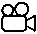
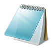
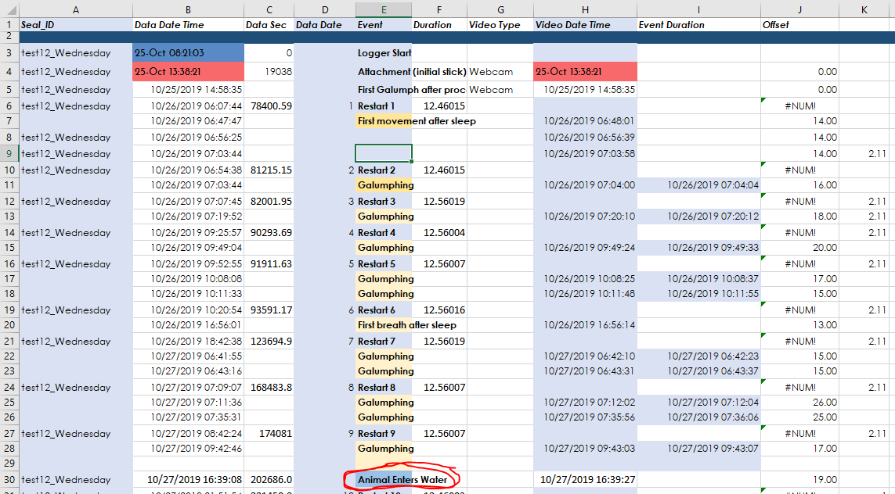
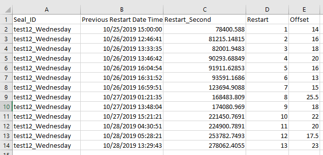

## [**STEP 03. Pair Motion & Video Data (optional)**](../03_Video-Data-Analysis)
   Pairing Motion & Video Data 

* **03.A.**  Video Data Synchronization (if needed) 
* **03.B.**  Pairing Video Data to Motion Data 

Output data: Pairing video scoring data to motion and environmental sensors

1. testNN_Nickname_**03_VideoMotionData_25Hz.csv** - Video scoring data paired to motion and environmental sensing data.

###   Pairing Motion & Video Data  

## **03.A.**  Video Data Synchronization (if needed) 

1.  **Overview:** Processing Step 03.A After having scored the video
    data, find synchronization points to adjust time points (ideally 2
    between each logger restart) to use so that video data aligns with
    motion data.

    1.  **Script:**
         None; manual.

    2.  **Input/Reference:**
        
        Video files
        &
        testNN_Nickname_00_VideoScoringData.csv

    3.  **Outputs: 00_Video_SyncPoints.xlsx & 00_Video_SyncPoints.csv**
        **  
        **See example spreadsheet below; after Restart 9 the animal
        entered the water 19 seconds later in the video than in the
        Logger Data.

4.  Create a simplified version of the sheet above that will be used to
    align timestamps between each restart.  
      
    For example, this sheet means that, based on the two sync points
    (offset durations 17s & 19s) between Restart 9 and 10, the logger
    was OFF and not recording for an average of 18s (in addition to
    already added default \~12.5 second correction per restart).

5.  Save this simplified sheet as a .CSV to be used in R:
    **00_Video_SyncPoints.csv**
    

## **03.A.**  Video Data Synchronization (if needed) 

2.  **Overview:** Processing Step 03.A After having scored the video
    data, find synchronization points to adjust time points (ideally 2
    between each logger restart) to use so that video data aligns with
    motion data.

    1.  **Script:**
        
        03_Video_and_Motion.R
        

    2.  **Inputs:**
        
        **00_Video_SyncPoints.csv** &
        **testNN_Nickname_00_VideoScoringData.csv**

    3.  **Output:**
        
        **testNN_Nickname_03_VideoMotionData_1Hz.csv &
        testNN_Nickname_03_VideoMotionData_25Hz.csv (to match Motion/Env
        Sensor frequency)**

3.  **What does the script do?**

    1.  **Loads seal metadata & critical timestamps**

    2.  **Loads**
        
        **00_Video_SyncPoints.csv** &
        **testNN_Nickname_00_VideoScoringData.csv**

    3.  **Creates “Restart-ogram”** with a row for each seconds with the
        value that should be subtracted from the Video R.Time timestamp
        to align it to the motion data.

    4.  **Aligns video & motion data** at full 25Hz resolution for
        Behavioral Automation (Step 04).

    5.  **Group by 1s & 30s time-bins** to match with lower resolution
        or Sleep Scoring Data.