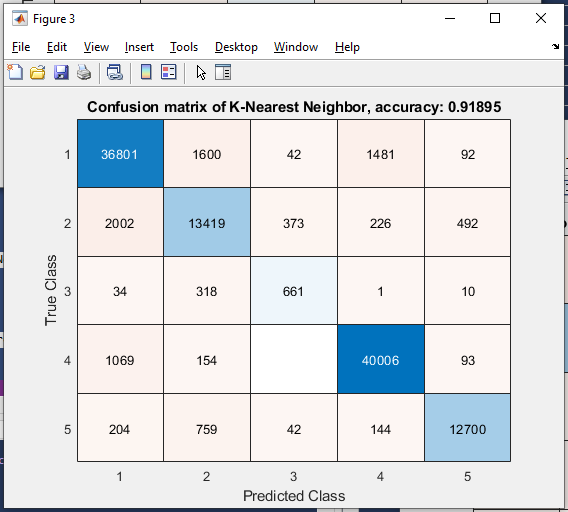

# [**STEP 04. Behavioral Scoring Automation**](../04_Behavioral-Scoring-Automation)
  Behavioral Scoring Automation 

* **04.A.**  Main Process 

##  Main Process 

1.  **Overview:** Processing Step 04.A: After pairing video and motion
    data, this labeled dataset can be used to train and test a machine
    learning algorithm.

    1.  **Script:**
        
        main_process.m (original written by Ding Zhang from University
        of Michigan)

    2.  **Input:** Labeled dataset, for example:
        **testNN_Nickname_03_VideoMotionData_25Hz.csv**

    3.  **Outputs:** Accuracy scores & confusion matrices- at some
        point : deployable model (in progress).

    4.  **Note :** Model outputs and outcomes are stored in
        **00_Ethogram.xlsx**  
        