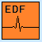
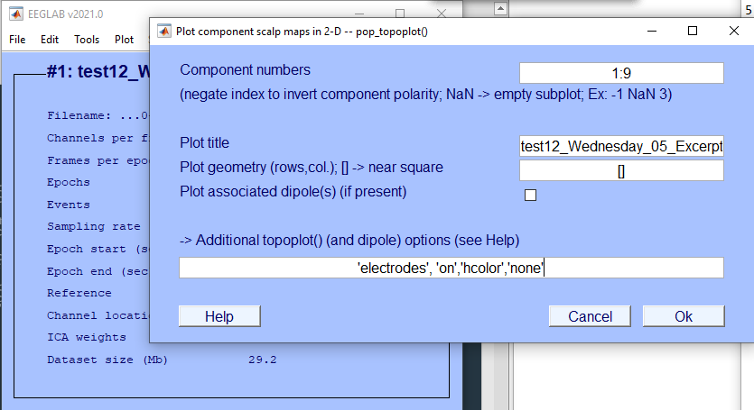
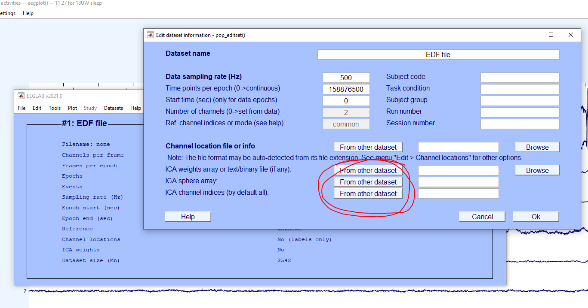
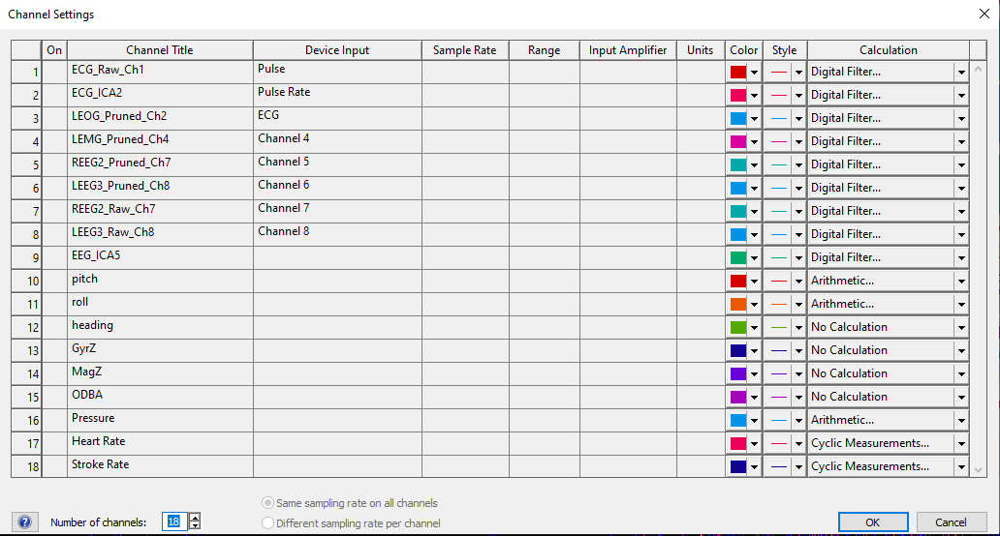

# [**STEP 05. ICA Processing for Electrophysiological Data**](../05_ICA-Processing)
   ICA Processing for Electrophysiological Data 

* **05.A.**   Load data into EEGLAB  
* **05.B.**  Subset Data  
* **05.C.**  Run ICA  
* **05.D.**  Inspect Results  
* **05.E.**  Apply ICA weights to whole dataset  
* **05.F.**  Export processed EDF 

###   ICA Processing for Electrophysiological Data 

## **05.A.**   Load data into EEGLAB  

1.  **Overview:** Processing Step 05.A: Opens EDF file Rearranged_ALL
    and only imports 9 electrophysiological channels

2.  1.  **Script:**
        
        ICA_Automation.m

    2.  **Input:** ***testNN_Nickname_01_ALL_Rearranged.edf***
        

    3.  **Outputs:** EEG variable through EEGLAB

## **05.B.**  Subset Data  

3.  **Overview:** Processing Step 05.B: subset your full EDF file into a
    short \~10 minute segment where (i) the animal is calm, (ii) the
    artifact you’d like to remove is apparent (for me: ECG signal),
    and (iii) there is an apparent signal of interest (for me: a clear
    change in underlying brain activity from waking to SWS to REM EEG
    activity).

    1.  **Script:**
        
        ICA_Automation.m

    2.  **Input:** Dataset 1 : whole EDF file

    3.  **Outputs:** Dataset 2 : subset EEG data for a segment of time
        underwater

## **05.C.**  Run ICA  

4.  **Overview:** Processing Step 05.C: Run ICA on the subset of your
    data. Use the runica function in EEGLAB.

    1.  **Script:**
        
        ICA_Automation.m

    2.  **Input:** Dataset 2 (subset for underwater)

    3.  **Outputs:** something.

## **05.D.**  Inspect Results  

5.  **Overview:** Processing Step 05.D: Examine ICA outputs, save images
    and topomaps.

6.  **Plot topomaps: Loads in the channel locations here:**  
    Data \> **00_EEG_Channel_Locations_Topomap.ced  
    **

## **05.E.**  Apply ICA weights to whole dataset  

7.  **Overview:** Processing Step 05.E: Apply ICA weights to the rest of
    the dataset.

8.  

## **05.F.**  Export processed EDF 

9.  Step 1: Open excerpt with ICA weights

10. Step 2: Open EDF file Rearranged_ALL; only import 9 electrophys

11. Step 3: Apply ICA weights in Edit Dataset – load from 1st
    dataset

12. Step 4: Identify and save brain_ica_data = EEG.icaact(n,:);  
    where n = component with maximal brain activity

13. Step 5: Identify and save heart_ica_data = EEG.icaact(n,:);  
    where n = component with maximal heart activity (in case better than
    raw ECG)

14. Step 6: Save raw data raw_data = EEG.data;

15. Prune data with 2 maximal HR artifact components

16. Save pruned data pruned_data = vertcat(EEG.data(2,:), EEG.data(4,:),
    EEG.data(7,:), EEG.data(8,:)); for LEOG, LEMG, REEG2, LEEG3 (use
    best)

17. Create variable megadata with all, read into EEGLAB as matlab
    variable at 500Hz and save as EDF file. Merge EDF file with
    motion/env sensors in EDF browser (or in matlab before write edf…)

18. Column descriptions for resulting Processed Megadata file:

    1.  **ECG_Raw_Ch1 :** raw heart rate data.

    2.  **ECG_ICA2** : ICA component which maximally expressed heart
        signals. I think this may be worthwhile in recordings where the
        ECG raw signal is noisy, and we may be able to recover the heart
        beat from the artifact it leaves in the other channels,
        especially when the animal is in water.

    3.  **LEOG_Pruned_Ch2** : LEOG channel with ICA components 1 and 2
        removed (to get rid of the heart beat artifact).

    4.  **LEMG_Pruned_Ch4** : LEMG channel with ICA components 1 and 2
        removed.

    5.  **REEG2_Pruned_Ch7** : REEG2 channel with ICA components 1 and 2
        removed.

    6.  **LEEG3_Pruned_Ch8** : LEEG3 channel with ICA components 1 and 2
        removed.

    7.  **REEG2_Raw_Ch7** : REEG2 channel for reference (may have heart
        beat artifact in water but not on land).

    8.  **LEEG3_Raw_Ch8** : LEEG3 channel for reference (may have heart
        beat artifact in water but not on land).

    9.  **EEG_ICA5** : ICA component 5 which, in this case, seemed to
        maximally express brain activity. In other words, you can use
        this channel to score sleep on land and in water. The signal
        amplitude of this channel is slightly lower than the pruned or
        raw EEG channels, but they should represent very similar
        patterns. Feel free to check this and let me know if you find
        inconsistencies.

    10. **Pitch** - the pitch of the animal (I believe this is positive
        90 degrees for an animal pitched upward in the "Vertical Up"
        position)

    11. **Roll** - the roll of the animal (180 degrees would mean the
        animal is on its back, 90 degrees on one of her sides - can
        check axes conventions)

    12. **Heading** - the heading of the animal (compass heading of the
        animal from 0 to 180)

    13. **GyrZ** - the Z-axis of the gyroscope which captures angular
        acceleration around the Z axis

    14. **MagZ** - magnetometer/compass to compare to heading

    15. **ODBA** - overall dynamic body acceleration.

    16. **Pressure** - in meters of sea water

    17. **Heart Rate** - calculated with raw heart rate data currently
        (could also be based on \#2 if helpful)

    18. **Stroke Rate** - calculated with gyroscope currently

