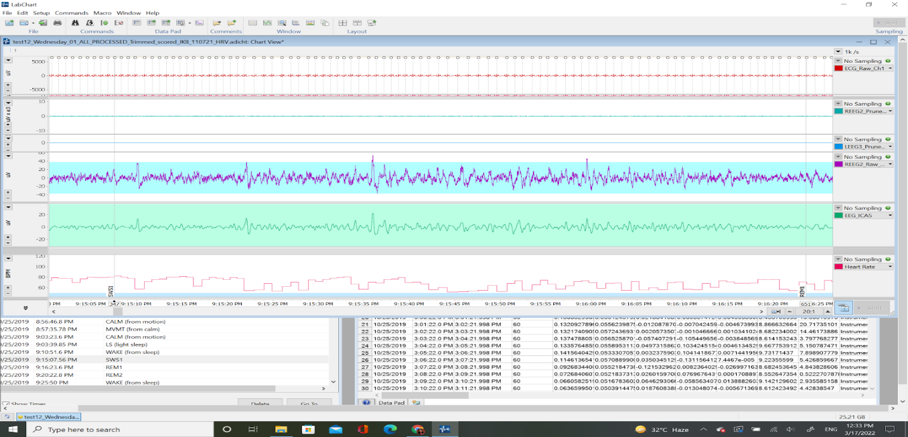

# [**STEP 06. Qualitative Sleep Analysis**](../06_Sleep-Scoring)
 Manually scoring sleep data 

* **06.A.** Load data into LabChart 
* **06.B.** Identify scorable segments 
* **06.C.** Score Heart Rate (HR) Patterns 
* **06.D.** Score Sleep Patterns 

###  Qualitative Sleep Scoring 

## **06.A.** Load data into LabChart 

1.  Overview: Processing Step 06.A: does this.

    1.  **Script:** .adiset   
        ( None; manual)

    2.  **Input:** testNN_Nickname_01_ALL_PROCESSED.adicht/
        testNN_Nickname_01_ALL_PROCESSED_Trimmed.adicht

    3.  **Outputs:**
        testNN_Nickname_01_ALL_PROCESSED_Trimmed_scored.adicht

        1.  **Copy/paste comments from** PROCESSED_Trimmed_scored
            LabChart file into Excel spreadsheet, insert: 

            1.  Seal ID (testNN_Nickname)

            2.  Date_Time (dd/mm/yyyy hh:mm:ss)

            3.  Channel_clean (if Channel column shows \* - input All;
                otherwise input whatever is written in Channel column)

            <!-- -->

            1.  Export as **06_Sleep_Scoring_Comments_Initials of the
                scorer.csv** for use in: **06_Hypnograms.R** in
                Processing Step 06.

## **06.B.** Identify scorable segments 

1.  **Identify unscorable segments** in the data that are contaminated
    with artifacts:

    1.  **Sleep State Scorable**: Place comment when the sleep state
        becomes scorable: at the beginning of the recording once
        artifact-free brain signals are present AND whenever an
        unscorable section ends (see below).

    2.  **Sleep State Unscorable**: Place comment when the sleep state
        becomes unscorable: when the animal is calm, but it is
        impossible to tell whether the animal is asleep or not due to
        artifacts in the signal.

    3.  **Heart Patterns Scorable**: Place comment when the heart rate
        patterns become scorable: at the beginning of the recording AND
        whenever an unscorable section ends (see below).

    4.  **Heart Patterns Unscorable**: Place comment when the heart rate
        patterns become unscorable: when there is too much error in the
        peak detection due to artifact to see when a period of eupnea or
        apnea begins.

## **06.C.** Score Heart Rate (HR) Patterns 

1.  **Score Heart Rate (HR) Patterns**: Be sure to maintain the order in
    which the following four comments are placed in an apnea-eupnea
    cycle, for this is critical for the hypnogram generation step. (Add
    these comments only to the HR channel)

    1.  **Anticipatory HR Increase:** Place comment at the start of the
        gradual increase to tachycardia during eupnea.

    2.  **First Breath**: Place comment at the first breath detected by
        accelerometer channel (or if obvious in HR channel). Sometimes
        the gyroscope channel or the overall dynamic body acceleration
        (ODBA) channel also pick up distinct breathing peaks. The
        amplitude of these peaks is lesser than those caused due to
        gross movement. Compare with neighboring segments having
        movement-related activity before scoring using gyroscope or ODBA
        channel.

    3.  **Last Breath:** Place comment at the last breath detected by
        accelerometer channel (or if obvious in HR channel).

    4.  **Start Apnea:** Place comment at the start of the low,
        bradycardic heart rate.

## **06.D.** Score Sleep Patterns 

1.  **Score Sleep Patterns** by placing comments at points of transition
    from one sleep state to another. Here pick an epoch size based on
    the minimum convenient duration of an individual
    scorable/quantifiable sleep stage.  (Add these comments to ALL
    channels)

    1.  **CALM (from motion):** Place comment at a transition from
        movement to calm (and at the beginning of the recording).

    2.  **LS (light sleep)/Drowsiness:** Place comment at a transition
        from waking to light sleep, where there are oscillations with
        10s periods of high amplitude slow waves followed by \~10s of
        low amplitude waking activity- primarily in the 1-7Hz frequency
        band.

    3.  **SWS:** Place comment at a transition from waking or light
        sleep to slow wave sleep 1 or 2 depending on the amount of
        maximal amplitude slow waves in the segment. 

        1.  **SWS1:** Place comment at a transition from waking or light
            sleep to slow wave sleep 1 when continuous high amplitude,
            low frequency EEG (0.5-4Hz) waves are seen. The amplitude is
            nearly 2-fold as compared to waking or REM parameters, but
            the waves of maximal amplitude (when compared to neighboring
            sleep cycles) do not occupy \>50% of the epoch. Sleep
            spindles often mark the transition to SWS1. K-complexes are
            also seen.

        2.  **SWS2:** Place comment at a transition from waking, light
            sleep or SWS1 to slow wave sleep 2 when continuous high
            amplitude, low frequency EEG (0.5-4Hz) of maximal amplitude
            occupies \>50% of the epoch duration. No sleep spindles or
            K-complexes are seen. 

            1.  **Note:** SWS1 often precedes SWS2 (especially if the
                spectrogram shows a crescendo-shaped slug.)

    4.  **REM:** Place comment at a transition from slow wave sleep (or
        waking if SURE) to REM sleep 1 or 2 depending on extent of
        accompanying HR variability. REM1 and/or REM2 may also coincide
        with eye movements and low EMG activity. 

        1.  **REM1 (Putative REM):**  Place comment at a transition from
            slow wave sleep (or waking IF SURE) to REM1 when low
            amplitude, high frequency EEG activity with low HR
            variability during apnea is seen.

        2.  **REM2 (Certain REM):** Place comment at a transition from
            slow wave sleep (or waking IF SURE) to REM2 if low
            amplitude, high frequency EEG activity with high, low
            frequency HR variability during apnea is seen. 

    5.  **WAKE (from sleep):** Place comment at a transition from sleep
        (light sleep, slow wave sleep, or REM sleep) to waking activity,
        where low frequency brain activity coincides with lower and
        higher frequency oscillations in heart rate or large
        oscillations in heart rate which are directly linked to
        respiratory patterns.

    6.  **JOLT (from sleep):** Place comment at a transition from sleep
        (light sleep, slow wave sleep, or REM sleep) to motion artifacts
        (active waking). If the arousal does not cause a change in sleep
        state, the animal may go directly back into the previous state.

    7.  **MVMT (from calm):** Place comment at a transition from calm or
        waking to movement with the presence of motion artifacts.

| ***Sleep Scoring Guide***                                                        |                                |               |                                                                                                                                                                                                                                                                                                              |
|----------------------------------------------------------------------------------|--------------------------------|---------------|--------------------------------------------------------------------------------------------------------------------------------------------------------------------------------------------------------------------------------------------------------------------------------------------------------------|
| Steps for scoring sleep (do these in the order provided).                        |                                |               |                                                                                                                                                                                                                                                                                                              |
|                                                                                  |                                |               |                                                                                                                                                                                                                                                                                                              |
| ***Shortcut***                                                                   | ***Comment Text***             | ***Channel*** | ***Description***                                                                                                                                                                                                                                                                                            |
| **1. INSTRUMENT ATTACHMENT**                                                     |                                |               |                                                                                                                                                                                                                                                                                                              |
| **Alt+1**                                                                        | Instrument ON Animal           | ECG           | Place comment where **ECG trace begins** because electrodes have just been attached to animal                                                                                                                                                                                                                |
| **Alt+2**                                                                        | Instrument OFF Animal          | ECG           | Place comment where **ECG trace ends** because electrodes have just been removed from animal                                                                                                                                                                                                                 |
| **2. IS THE ANIMAL IN THE WATER?**                                               |                                |               |                                                                                                                                                                                                                                                                                                              |
| **Alt+3**                                                                        | Animal Enters Water            | Pressure      | Place comment when the **pressure sensor goes from -0.1 to a higher value.** Also will be accompanied by a change in accelerometer signals from mostly flat to lots of up and down.                                                                                                                          |
| **Alt+4**                                                                        | Animal Exits Water             | Pressure      | Place comment if **(A) pressure sensor returns to -0.1 AND (B) accelerometer trace returns to on-land patterns** (mostly flat in between galumphing, as opposed to constant motion in shallow water).                                                                                                        |
| **3. IS THE SLEEP DATA SCORABLE?**                                               |                                |               |                                                                                                                                                                                                                                                                                                              |
| **Alt+{**                                                                        | Sleep State Scorable           | All           | Place comment when the **sleep state becomes scorable:** at the beginning of the recording once artifact-free brain signals are present AND whenever an unscorable section ends (see below).                                                                                                                 |
| **Alt+}**                                                                        | Sleep State Unscorable         | All           | Place comment when the **sleep state becomes unscorable:** when the animal is calm, but it is impossible to tell whether the animal is asleep or not due to artifacts in the signal.                                                                                                                         |
| **4. FIND SECTIONS OF DATA TO USE IN INDEPENDENT COMPONENT ANALYSIS (OPTIONAL)** |                                |               |                                                                                                                                                                                                                                                                                                              |
| **Shift+\<**                                                                     | Begin Calm in Water            | Pressure      | Place comment where **underwater data is clean, the animal stops stroking, and is not moving** (from accel/pressure) to send to ICA for analysis.                                                                                                                                                            |
| **Shift+\>**                                                                     | End Calm in Water              | Pressure      | Place comment at the **end of a section** where the animal has been calm according to criteria above.                                                                                                                                                                                                        |
| **5. IS THE HEART RATE DATA SCORABLE?**                                          |                                |               |                                                                                                                                                                                                                                                                                                              |
| **Shift+{**                                                                      | Heart Patterns Scorable        | HR            | Place comment when the **heart rate patterns become scorable:** at the beginning of the recording AND whenever an unscorable section ends (see below).                                                                                                                                                       |
| **Shift+}**                                                                      | Heart Patterns Unscorable      | HR            | Place comment when the **heart rate patterns become unscorable:** when there is too much error in the peak detection due to artifact to see when a period of eupnea or apnea begins.                                                                                                                         |
| **6. SCORE HEART RATE PATTERNS**                                                 |                                |               |                                                                                                                                                                                                                                                                                                              |
| **Alt+B**                                                                        | ***Anticipatory HR Increase*** | HR            | Place comment at the **start of the gradual increase to tachycardia** during eupnea.                                                                                                                                                                                                                         |
| **Alt+F**                                                                        | ***First Breath***             | HR            | Place comment at the **first breath detected** by accelerometer channel (or if obvious in HR channel).                                                                                                                                                                                                       |
| **Alt+L**                                                                        | ***Last Breath***              | HR            | Place comment at the **last breath detected** by accelerometer channel (or if obvious in HR channel).                                                                                                                                                                                                        |
| **Alt+A**                                                                        | ***Start Apnea***              | HR            | Place comment at the **start of the low, bradycardic heart rate**                                                                                                                                                                                                                                            |
| **7. SCORE SLEEP PATTERNS**                                                      |                                |               |                                                                                                                                                                                                                                                                                                              |
| **Alt+C**                                                                        | ***CALM (from motion)***       | All           | Place comment at a transition **from movement to calm** (and at the beginning of the recording).                                                                                                                                                                                                             |
| **Alt+I**                                                                        | ***LS (light sleep)***         | All           | Place comment at a transition **from waking to light sleep,** where there are oscillations with 10s periods of high amplitude slow waves followed by \~10s of low amplitude waking activity- primarily in 1-7Hz frequency band.                                                                              |
| **Alt+S**                                                                        | ***SWS***                      | All           | Place comment at a transition **from waking or light sleep to slow wave sleep:** continuous high amplitude slow waves- primarily in the 0.5-4Hz frequency band.                                                                                                                                              |
| **Alt+R**                                                                        | ***REM***                      | All           | Place comment at a transition **from slow wave sleep (or waking if SURE) to REM sleep** where low voltage electrical activity coincides with **high power, low freqency (0.1Hz) irregular oscillations in heart rate.** May also coincide with eye movements and low EMG activity.                           |
| **Alt+W**                                                                        | ***WAKE (from sleep)***        | All           | Place comment at a transition **from sleep (light sleep, slow wave sleep, or REM sleep) to waking activity,** where low frequency brain activity coincides with lower and higher frequency oscillations in heart rate or large oscillations in heart rate which are directly linked to respiratory patterns. |
| **Alt+J**                                                                        | ***JOLT (from sleep)***        | All           | Place comment at a transition **from sleep (light sleep, slow wave sleep, or REM sleep) to motion artifacts (active waking).** If the arousal does not cause a change in sleep state, the animal may go directly back into the previous state.                                                               |
| **Alt+M**                                                                        | ***MVMT (from calm)***         | All           | Place comment at a transition **from calm or waking to movement** with the presence of motion artifacts.                                                                                                                                                                                                     |
###  Load Data

### Appendix: Additional Sleep Scoring Examples

CALM \> SWS1 \> SWS2 example

CALM \> SWS1 \> REM1 example

