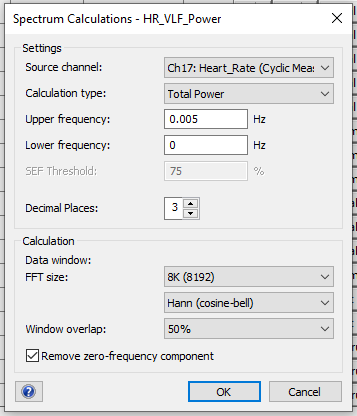

# [**STEP 08. 3D Track Generation & Visualization**](../08_3D-Track-Generation-and-Visualization)
  3D Track Generation   

* **08.A.**  Export Rates & Power from LabChart 
* **08.B.**  Export LabChart Calculations 
* **08.C.**  Estimate Speed from Processed Data 
* **08.D.**  Return to `CATS Toolbox` for Processing 
* **08.E.**  Review Track Generation 
* **08.F.**  Correct GPS points & rerun (if needed) 

###  3D Track Generation   

## **08.A.**  Export Rates & Power from LabChart 

1.  **Overview:** Export 1Hz data on Heart Rate, Stroke Rate, and Delta
    EEG Power (L & R) data exported from LabChart.

    1.  **Script:**
         None; manual.

    2.  **Input:** **testNN_Nickname_05_ALL_PROCESSED_Trimmed.**adicht

    3.  **Output:
        testNN_Nickname_06_ALL_PROCESSED_Trimmed_withRATES_POWER.txt**
        **  
        **Exported LabChart Text File (downsampled 500X from original)
        

2.  **Verify ‘Heart_Rate’ & ‘Stroke_Rate’ channels are properly named
    (after ‘Pressure’)**

3.  **Create new channels:**

    1.  **L_EEG_Delta** (best L EEG channel spectral power calculation
        between 4 Hz & 0.5Hz)

    2.  **R_EEG_Delta** (best R EEG channel spectral power calculation
        between 4 Hz & 0.5Hz)

    3.  **HR_VLF_Power** (spectral power calculation between 0.005 Hz &
        0 Hz)

4.  **HR_VLF_Power** Spectrum settings:  
    

5.  **EEG_Delta** Spectrum settings:  
    

<!-- -->  

6.  **Export as LabChart text file with these settings (will save first
    column as Time of day in seconds):  
    **

## **08.B.**  Export LabChart Calculations 

7.  Open data pad 

8.  Delete all existing information from data pad

9.  Make sure that the best EEG channel is chosen for the EEG analysis

10.  Make the following changes/additions in Columns X, Y, Z

> 

1.  Change the Time Mode (by right-clicking in the timeline on the
    bottom of the Chart View in LabChart) to **“Show as time of day”**
    and **uncheck** Show time as seconds.

> 

10. Click on **Multiple Add to Data Pad** keeping the following settings
    –

> 

11. Wait while it generates the data

12. Copy paste all generated data onto a blank Excel file

13. Add columns for Seal_ID and Date_Time, format timestamps to
    ‘mm/dd/yyyy hh:mm:ss’

14. Save your data as:

## **08.C.**  Estimate Speed from Processed Data 

1.  **Overview:** Use Processing Step 08.B in **08_Speed-Estimation.m**
     to estimate speed
    manually using 1Hz Stroke Rate data exported from LabChart and
    pitch, roll, heading.

    1.  **Script:**
        
        **08_Speed_Estimation.m** 

    2.  **Input:**
        **testNN_Nickname_06_ALL_PROCESSED_Trimmed_withRATES_POWER.txt**
        **  
        **Exported LabChart Text File (downsampled 500X from original)
        

    3.  **Outputs:** Speed vector to be used in CATS Processing

2.  Instructions:

## **08.D.**  Return to `CATS Toolbox` for Processing 

1.  **Overview:** Processing Step 02.H Return to Section 9 in CATS
    toolbox (should be able to re-import ‘…truncate.mat’ file and it
    will recognize your progress based on the ‘…Info.mat’ file.

    1.  **Script:**
        
        **MainCATSprhTool_JKB.m**

    2.  **Input:** Previous PRH .mat file, additional manual speed
        variable, and GPS hits spreadsheet
        

    3.  **Outputs:** Pseudotrack & Geo-referenced pseudotrack based on
        speed
        estimates

## **08.E.**  Review Track Generation 

2.  **Overview:** Manual inspection of the generated tracks in ArcGIS
    and/or Matlab. Remove and/or adjust inaccurate GPS points (making
    notes of any manipulation/justification in the “Notes” column).

    1.  **Script:**
        
        **MainCATSprhTool_JKB.m**  **& Review in Google
        Maps or ArcGIS**

    2.  **Input:** testNN_Nickname_GPShits.xlsx
         &
        testNN_Nickname_08_5HzgeoPtrackLatLong.csv
        

    3.  **Outputs:** testNN_Nickname_GPShits**\_UserModified**.xlsx
        

3.  **Instructions:**

    1.  Open generated track
        **testNN_Nickname_08_5HzgeoPtrackLatLong.csv** in ArcGIS Pro
        (drag & drop CSV into Contents panel).

    2.  Convert **XY Point Data**:  
        

    3.  **Drag & drop geoPtrack CSV** from Contents panel to “Input
        Table” field.  
        

    4.  Press “Run”

    5.  Click on a point to see what time it was recorded at. Use ArcGIS
        or Google Maps to re-associate that point in time to a more
        accurate GPS point based on animal observations or landmasses
        (nearest coastal interface for inland points).

##  **08.F.**  Correct GPS points & rerun (if needed) 

4.  **Overview:** Re-run section 13b and import corrected GPS points to
    re-generate track.

    1.  **Script:**
        
        **MainCATSprhTool_JKB.m**

    2.  **Input:** Previous PRH .mat file, additional manual speed
        variable, and corrected GPS hits spreadsheet:
        testNN_Nickname_GPShits**\_UserModified**.xlsx
        

    3.  **Outputs:
        testNN_Nickname_08_5HzgeoPtrackLatLong_manualspeed_manualGPScorrection.csv**
        

> Pseudotrack & Geo-referenced pseudotrack based on speed estimates

###  Hypnotrack Visualizations   

###  Generate Hypnotrack 

1.  **Overview:** Processing Step 09.A; After generating a pseudotrack
    and geo-referenced pseudotrack, you are ready to link sleep and
    motion data to a 3D track to visualize and interpret.

    1.  **Script:**
        
        **09_Hypnotracks.m**

    2.  **Inputs:**

        1.  **Motion Data:** testNN_Nickname_08_PRH_file_5Hzprh.mat

        2.  **Hypnogram:** testNN_Nickname_06_Hypnogram_JKB_5Hz.csv

        3.  LatLongs:

        4.  Ptrack & geoPtrack variables from CATS Processing
            

    3.  **Outputs:** CSV with Ptrack & geoPtrack variables to be matched
        with hypnogram data later on.

        1.  **Rename output:**
            testNN_Nickname_1HzgeoPtrackLatLong_manualspeed_manualGPScorrection.csv

            1.  Rename with ‘\_manualspeed’ if speed was calculated
                based on stroke rate manually.

            2.  Rename with ‘\_manualGPScorrection’ if GPS positions
                were checked and eliminated or adjusted to fit the
                contour of the coast manually

        2.  **Rename output:**

            1.  Make copy of prh mat file and rename:
                “testNN_Nickname_08_PRH_file_5Hzprh.mat”

###  3D Sleep Maps in ArcGIS 

1.  **Overview:** Import CSV; transform XY table to Point (with Z field
    = Depth); style based on categorical sleep variable; enable time and
    export as 3D animation if desired.

    1.  **Script:** none; manual.

    2.  **Input:** 1Hz hypnotrack file.

    3.  **Outputs:** 3D maps (pngs).

###  3D Sleep Animations in Maya 

2.  **Overview:** Follow [Visualizing Life in the Deep
    animation/visualization
    pipeline](https://github.com/jmkendallbar/VisualizingLifeintheDeep)
    to visualize underwater behavior and physiology.

    1.  **Scripts:** Github repository:
        <https://github.com/jmkendallbar/VisualizingLifeintheDeep>

    2.  **Input:** 25Hz, 5Hz, and 1Hz hypnotrack data.

    3.  **Outputs:** 3D animations (mp4s).

    4. **Instructions:** Prepare 10Hz data for importing into Maya:
            1. **GLIDE CONTROLLER:** Create new channel with arithmetric: `Smooth(Window(Ch18,0,15),15)` This applies a smoothing filter of 15 seconds and sets any value between a stroke rate of 0 and 15 strokes per minute to 1 (GLIDE) and any stroke rates above 15 strokes per minute to 0 (SWIM).
            2. **SWIM CONTROLLER:** Cyclic measurement that uses GyrZ channel with Smoothing = 100 ms; Median filtering with a window of 3 pts; High-pass cutoff: 0.3Hz; Auto-leveling/normalization window of 3s and 0.1 rps; Minimum peak height: 0.15; minimum period 500 ms; peak search window: 30s
            3. **EXPORT:** Generate .txt file :
            