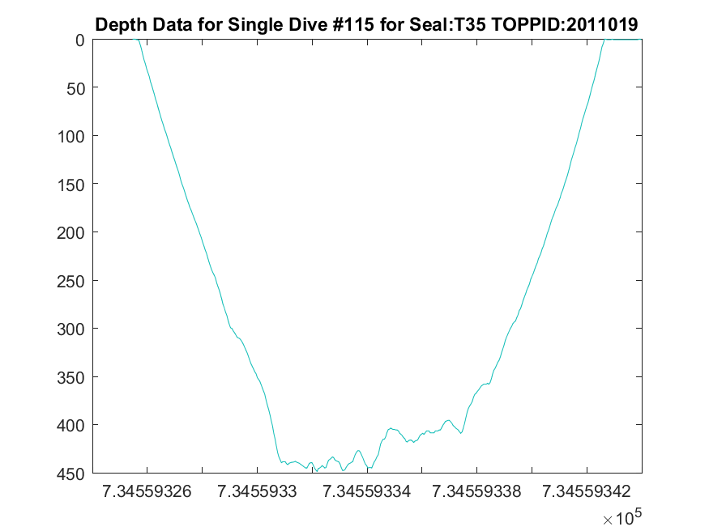
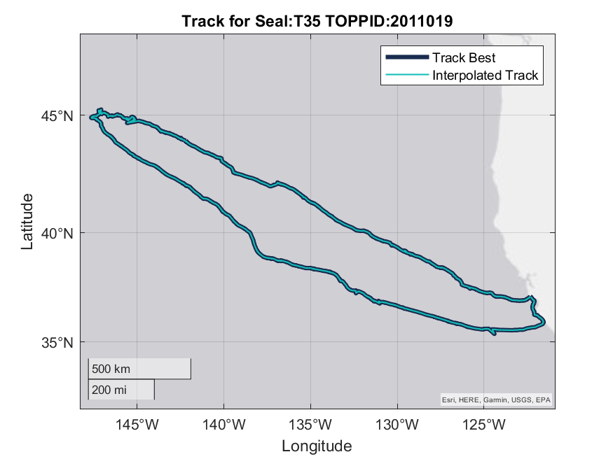
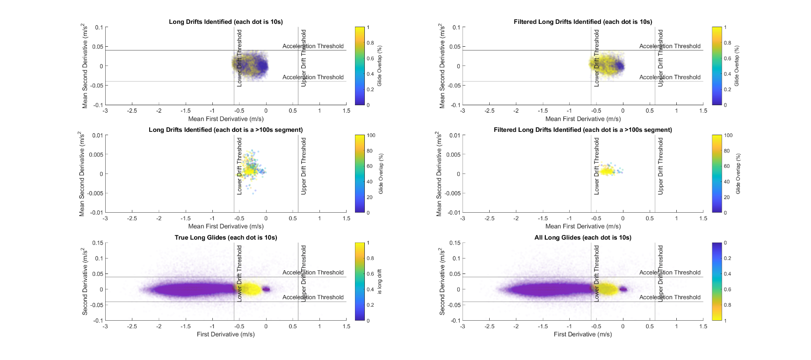

#  Sleep Estimates: quantifying measures of behavioral sleep 

1.  **Overview:** Estimate sleep time for northern elephant seals
    based on behavioral estimates of rest (cessation of stroking and
    flattening of vertical speed).

    1.  **Script:**
        
        ***11_Restimates.m*** 

    2.  **Inputs:** MAT files, raw CSV dive data for Sleep,
        Kami/Stroke, or TDR-only recordings.

    3.  **Outputs:** Behavioral Restimates! Images & CSVs:

2.  ###  Load Data

    1.  **Overview:**

        1.  Loads in and previews data.

        2.  **Loads** in and previews EEG data

        3.  **Check timestamps** are continuous

        4.  **Down-samples 1Hz data** to sampling interval = 10s.

        5.  **Standardize resolution** of pressure sensor (ours is more
            sensitive than typical depth sensors used in adult female
            deployments, so we rounded to the nearest meter)

    2.  **Inputs:** MAT files, raw CSV dive data for Sleep, Kami/Stroke,
        or TDR-only recordings.

        1.  ***Sleep Data:  
            **SealID_09_sleep_raw_data_Hypnotrack_JKB_1Hz.csv*
            
            *(SealID: testNN_Nickname)*

        2.  ***Stroke Data:  
            **SealID_stroke_raw_data.csv*
            
            *(SealID example: 2012-PM_X106 post-molt trip)*

        3.  ***Dive Data:**  
            SealID_iknos_raw_data.csv (SealID example: varied)*

        <!-- -->

        1.  **Outputs:** Preview images & NewRaw
            

2.  ###  Process Depth Data 

    1.  ### **Depth Correction**

        1.  **Overview:** Corrects depth data for uncorrected Stroke
            data, other dive data is already zero-offset corrected using
            IKNOS dive analysis package.

            1.  Find surface intervals:

                1.  Look for consecutive sections where the first
                    derivative \< 0.1 m/s

                2.  Filter out chunks where median depth is more than 40
                    (finds likely surface intervals)

            2.  Place this depth recorded during shallow flat chunks in
                NewRaw.DepthCorrection in the original dataset.

            3.  Use this depth correction to adjust depth values.

        1.  **Inputs:** Uncorrected StrokeRaw.CorrectedDepth
            

        2.  **Outputs:** Corrected StrokeRaw.CorrectedDepth
            

        3.  **Instructions:** If you like the depth correction, run the
            next section. If not, adjust settings or inspect variables.

    2.  ### **Data Truncation**

        1.  **Overview:** Removes (sometimes very long) flat sections
            before and after diving data using corrected depth data and
            removing long flat chunks at beginning and end of the
            recording. Creates a list of flat chunks (combines potential
            dives and surface intervals because sometimes depth sensor
            will hang on a large positive or negative value). This step
            also generates a list of potential dives with which to
            perform data alignment (next step).

            1.  Find potential dives / surface intervals:

                1.  Look for consecutive sections where the depth \< or
                    \> 2 meters

                2.  Generate stats for potential dives & potential
                    surface intervals

            2.  Concatenate potential dives / surface intervals (to find
                longest last one whether recognized as a dive or a
                surface interval).

            3.  Truncate data by removing the first and last chunk of
                flat data. Include 1000 samples on either side to avoid
                truncating data.

            4.  Inspect results.

        <!-- -->

        1.  **Inputs:** Untruncated StrokeRaw
            

        2.  **Outputs:** Truncated StrokeRaw
            

        3.  **Instructions:** If you like the truncation, run the next
            section. If not, adjust settings or inspect variables.

    3.  ### **Data Alignment**

        1.  **Overview:** Attempts to find the potential offset between
            NewRaw (mk10 dive data) and StrokeRaw (Kami/Stroke loggers)
            by matching up the time of the second deepest dive in the
            first 50 dives. We used second deepest dive to avoid
            occasional.

            1.  Find potential dives / surface intervals:

                1.  Look for consecutive sections where the depth \< or
                    \> 2 meters

                2.  Generate stats for potential dives & potential
                    surface intervals

            2.  Concatenate potential dives / surface intervals (to find
                longest last one whether recognized as a dive or a
                surface interval).

            3.  Truncate data by removing the first and last chunk of
                flat data. Include 1000 samples on either side to avoid
                truncating data.

            4.  Inspect results.

        <!-- -->

        1.  **Inputs:** Untruncated StrokeRaw
            

        2.  **Outputs:** Truncated StrokeRaw
            

        3.  **Instructions:** If you like the depth correction, run the
            next section. If not, adjust settings or inspect variables.

    4.  ### **Inputs:** MAT files, raw CSV dive data for Sleep, Kami/Stroke, or TDR-only recordings.

        1.  ***Sleep Data:  
            **SealID_09_sleep_raw_data_Hypnotrack_JKB_1Hz.csv*
            
            *(SealID: testNN_Nickname)*

        2.  ***Stroke Data:  
            **SealID_stroke_raw_data.csv*
            
            *(SealID example: 2012-PM_X106 post-molt trip)*

        3.  ***Dive Data:**  
            SealID_iknos_raw_data.csv (SealID example: varied)*

        <!-- -->

        1.  **Outputs:** Preview images & NewRaw
            

            1.  TOPPID_SEALID_00\_**Dive-Example.png**

            2.  TOPPID_SEALID_00\_**Track.png  
                > ***Snapshots of diving data and track allow a quick
                > assessment of whether raw diving data is aligned with
                > MAT files. If diving data is not aligned with MAT
                > file, a 0 will be placed in
                > **Seals_Used.Dive_data_aligned_with_MAT_file(k).***

            3.  TOPPID_SEALID_01\_**StrokeRaw-NewRaw_Alignment-Check.png**

            4.  TOPPID_SEALID_02\_**Dive-Smooth.png**

            5.  TOPPID_SEALID_03\_**Drift-Dive-Output.png**

            6.  TOPPID_SEALID_03\_**Drift-Dive-Ouput_Trip-percent-NNN_24h.png**

            7.  TOPPID_SEALID_03\_**Drift-Dive-Stats.png**

            1.  Summary Statistics:

                1.  TOPPID_SEALID_10\_**Daily Stats.csv**

                2.  TOPPID_SEALID_10\_**Dive Stats.csv**

                3.  TOPPID_SEALID_10\_**Drifts_with_Stats.csv**

                4.  TOPPID_SEALID_10\_**SleepStats.csv**

> 

5.  TOPPID_SEALID_03\_**Drift-Rate-Smoothed.png**