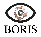
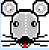
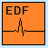

# **Sleep Study Protocol**

For more information on Data Analysis steps and current progress, see
GDrive 🗀 Sleep_Analysis \> 🗀 Scripts \> 00_Data_Analysis_Tracking.xlsx).
Generally, all scripts or settings files used to generate subsequent
data steps are in 🗀 Sleep_Analysis \> 🗀 Scripts and inputs/outputs for
each step are stored in 🗀 Sleep_Analysis \> 🗀 Data. To improve clarity
about which tools and filetypes are required and used by different
programs, we are using the following icons to represent different file
extensions:

-   Text file (.csv or .txt)
-    RStudio (.R script)
-    Excel (.xlsx worksheet)
-    BORIS Behavioral Program ([download
    here](https://boris.readthedocs.io/en/latest/))
-    Neurologger Software
-    EDF Browser ([download
    here](https://www.teuniz.net/edfbrowser/index.html))
-    LabChart (ADInstruments download here)
-    MATLAB v2020b 
    *  EEGLAB MATLAB toolbox
    for EEG research ([download here](https://eeglab.org/download/))  
    *  CATS MATLAB toolbox for
    Biologging tools ([download
    here](https://github.com/wgough/CATS-Methods-Materials))
-    ArcGIS Pro (ESRI)
-    Autodesk Maya

***Automated or manual review required:***

 Manual review required  
 Automated process  
  Semi-automated process

# Sleep Data Processing Pipeline

## [**STEP 00. Organize Metadata**](./00_Metadata)
   Metadata   and Video Scoring 

* **00.A.**   Notes  & Sleep_Study_Metadata 
* **00.B.**    Location Data Processing
* **00.C.**    Video Scoring  

## [**STEP 01. Convert Raw Data**](http://www.evolocus.com/neurologger-3.htm)
    Convert Raw Data. This step uses the [Neurologger Converter & Visualizer from Evolocus LLC](http://www.evolocus.com/neurologger-3.htm)

* **01.A.**     Download and convert data 
* **01.B.**  Rearrange EDF 
* **01.C.**   Visualize Raw Data in LabChart 
* **01.D.**   Raw Scoring 

## [**STEP 02. Process Motion Sensor Data**](./02_Processing-Motion-Env-Sensors)
    Processing Motion & Environmental Sensors 

*Scripts:* `02_ProcessingMotionEnvSensors.m` & [`CATS Toolbox`](https://github.com/wgough/CATS-Methods-Materials)

> Cade, D.E., Gough, W.T., Czapanskiy, M.F. et al. Tools for integrating inertial sensor data with video bio-loggers, including estimation of animal orientation, motion, and position. *Anim Biotelemetry* **9**, 34 (2021). https://doi.org/10.1186/s40317-021-00256-w

*Input:* Raw motion & environmental sensor data

* **02.A.**  [Read in Metadata]()
* **02.B.**  Load Motion & Environmental Data 
* **02.C.**  Resample Data
* **02.D.**  MAT File setup for CATS Toolbox
* **02.E.**    Run [`CATS Toolbox`](https://github.com/wgough/CATS-Methods-Materials)
* **02.F.**  Save Calibrated & Processed Data

## [**STEP 03. Pair Motion & Video Data (optional)**](./03_Video-Data-Analysis)
   Pairing Motion & Video Data 

* **03.A.**  Video Data Synchronization (if needed) 
* **03.B.**  Pairing Video Data to Motion Data 

## [**STEP 04. Behavioral Scoring Automation**](./04_Behavioral-Scoring-Automation)
  Behavioral Scoring Automation 

* **04.A.**  Main Process 

## [**STEP 05. ICA Processing for Electrophysiological Data**](./05_ICA-Processing)
   ICA Processing for Electrophysiological Data 

* **05.A.**   Load data into EEGLAB  
* **05.B.**  Subset Data  
* **05.C.**  Run ICA  
* **05.D.**  Inspect Results  
* **05.E.**  Apply ICA weights to whole dataset  
* **05.F.**  Export processed EDF 

## [**STEP 06. Qualitative Sleep Analysis**](./06_Sleep-Scoring)
 Manually scoring sleep data 

* **06.A.** Load data into LabChart 
* **06.B.** Identify scorable segments 
* **06.C.** Score Heart Rate (HR) Patterns 
* **06.D.** Score Sleep Patterns 

## [**STEP 07. Generate Hypnograms for Quantitative Sleep Analysis**](./07_Scored-Sleep-Analysis)
 Generating hypnograms (CSV with sleep state, respiratory state, and water code) for 5Hz, 1s, and 30s intervals. 

## [**STEP 08. 3D Track Generation & Visualization**](./08_3D-Track-Generation-and-Visualization)
  3D Track Generation   

* **08.A.**  Export Rates & Power from LabChart 
* **08.B.**  Export LabChart Calculations 
* **08.C.**  Estimate Speed from Processed Data 
* **08.D.**  Return to `CATS Toolbox` for Processing 
* **08.E.**  Review Track Generation 
* **08.F.**  Correct GPS points & rerun (if needed) 

## [**STEP 09. Hypnotrack Generation & Visualization**](./09_Hypnotrack-Generation-and-Visualization)
  Hypnotrack Visualizations   

* **09.A.**  Generate **hypnotrack** 
* **09.B.**  3D Sleep Maps in Arc GIS 
* **09.C.**   3D Sleep Animations in Maya 

## [**STEP 10. Data Aggregation & Standardization**](10_Data-Aggregation-and-Standardization)
 Reading in and standardizing depth data across datasets. 

* **00.** Load Data
* **01.** Process Data
    * **01.A.** Depth Correction
    * **01.B.** Data Truncation
    * **01.C.** Data Alignment
    * **Inputs:** MAT files, raw CSV dive data for Sleep, Kami/Stroke,
or TDR-only recordings.

## [**STEP 11. Sleep Estimates: estimating sleep across datasets**](11_Sleep-Estimates)

## [**STEP 12. Summarize all data**](12_Summary)
  Summarizing Sleep Scoring & Restimates Model Output 

*Script:* [`12_Summary.Rmd`]()
