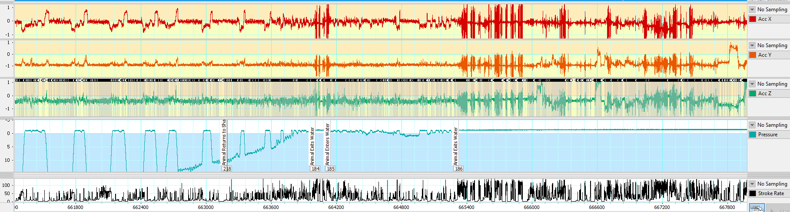
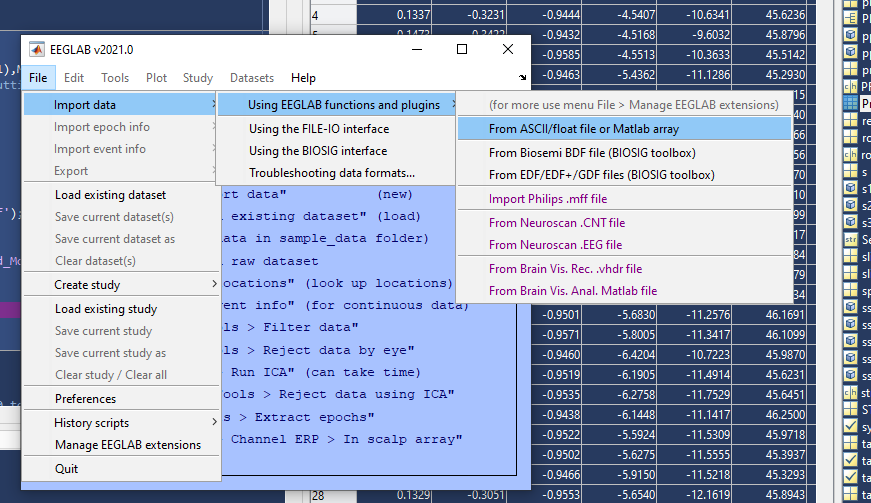

# **Sleep Study Protocol**

For more information on Data Analysis steps and current progress, see
GDrive 🗀 Sleep_Analysis \> 🗀 Scripts \> 00_Data_Analysis_Tracking.xlsx).
Generally, all scripts or settings files used to generate subsequent
data steps are in 🗀 Sleep_Analysis \> 🗀 Scripts and inputs/outputs for
each step are stored in 🗀 Sleep_Analysis \> 🗀 Data. To improve clarity
about which tools and filetypes are required and used by different
programs, we are using the following icons to represent different file
extensions:

-   Text file (.csv or .txt)
-    RStudio (.R script)
-    Excel (.xlsx worksheet)
-    BORIS Behavioral Program ([download
    here](https://boris.readthedocs.io/en/latest/))
-    Neurologger Software
-    EDF Browser ([download
    here](https://www.teuniz.net/edfbrowser/index.html))
-    LabChart (ADInstruments download here)
-    MATLAB v2020b 
    *  EEGLAB MATLAB toolbox
    for EEG research ([download here](https://eeglab.org/download/))  
    *  CATS MATLAB toolbox for
    Biologging tools ([download
    here](https://github.com/wgough/CATS-Methods-Materials))
-    ArcGIS Pro (ESRI)
-    Autodesk Maya

***Automated or manual review required:***

 Manual review required  
 Automated process  
  Semi-automated process

# Sleep Data Processing Pipeline

## [**STEP 00. Organize Metadata**](./00_Metadata)
   Metadata   and Video Scoring 

* **00.A.**   Notes  & Sleep_Study_Metadata 
* **00.B.**    Video Scoring  

## [**STEP 01. Convert Raw Data**](http://www.evolocus.com/neurologger-3.htm)
    Convert Raw Data. This step uses the [Neurologger Converter & Visualizer from Evolocus LLC](http://www.evolocus.com/neurologger-3.htm)

* **01.A.**     Download and convert data 
* **01.B.**  Rearrange EDF 
* **01.C.**   Visualize Raw Data in LabChart 
* **01.D.**   Raw Scoring 

## [**STEP 02. Process Motion Sensor Data**](./02_Processing-Motion-Env-Sensors)
    Processing Motion & Environmental Sensors 

*Scripts:* `02_ProcessingMotionEnvSensors.m` & [`CATS Toolbox`](https://github.com/wgough/CATS-Methods-Materials)

> Cade, D.E., Gough, W.T., Czapanskiy, M.F. et al. Tools for integrating inertial sensor data with video bio-loggers, including estimation of animal orientation, motion, and position. *Anim Biotelemetry* **9**, 34 (2021). https://doi.org/10.1186/s40317-021-00256-w

*Input:* Raw motion & environmental sensor data

* **02.A.**  [Read in Metadata]()
* **02.B.**  Load Motion & Environmental Data 
* **02.C.**  Resample Data
* **02.D.**  MAT File setup for CATS Toolbox
* **02.E.**    Run [`CATS Toolbox`](https://github.com/wgough/CATS-Methods-Materials)
* **02.F.**  Save Calibrated & Processed Data

## [**STEP 03. Pair Motion & Video Data (optional)**](./03_Video-Data-Analysis)
   Pairing Motion & Video Data 

* **03.A.**  Video Data Synchronization (if needed) 
* **03.B.**  Pairing Video Data to Motion Data 

## [**STEP 04. Behavioral Scoring Automation**](./04_Behavioral-Scoring-Automation)
  Behavioral Scoring Automation 

* **04.A.**  Main Process 

## [**STEP 05. ICA Processing for Electrophysiological Data**](./05_ICA-Processing)
   ICA Processing for Electrophysiological Data 

* **05.A.**   Load data into EEGLAB  
* **05.B.**  Subset Data  
* **05.C.**  Run ICA  
* **05.D.**  Inspect Results  
* **05.E.**  Apply ICA weights to whole dataset  
* **05.F.**  Export processed EDF 

## [**STEP 06. Qualitative Sleep Analysis**](./06_Sleep-Scoring)
 Manually scoring sleep data 

* **06.A.** Load data into LabChart 
* **06.B.** Identify scorable segments 
* **06.C.** Score Heart Rate (HR) Patterns 
* **06.D.** Score Sleep Patterns 

## [**STEP 07. Generate Hypnograms for Quantitative Sleep Analysis**](./07_Scored-Sleep-Analysis)
 Generating hypnograms (CSV with sleep state, respiratory state, and water code) for 5Hz, 1s, and 30s intervals. 

## [**STEP 08. 3D Track Generation & Visualization**](./08_3D-Track-Generation-and-Visualization)
  3D Track Generation   

* **08.A.**  Export Rates & Power from LabChart 
* **08.B.**  Export LabChart Calculations 
* **08.C.**  Estimate Speed from Processed Data 
* **08.D.**  Return to `CATS Toolbox` for Processing 
* **08.E.**  Review Track Generation 
* **08.F.**  Correct GPS points & rerun (if needed) 

## [**STEP 09. Hypnotrack Generation & Visualization**](./09_Hypnotrack-Generation-and-Visualization)
  Hypnotrack Visualizations   

* **09.A.**  Generate **hypnotrack** 
* **09.B.**  3D Sleep Maps in Arc GIS 
* **09.C.**   3D Sleep Animations in Maya 

## [**STEP 10. Data Aggregation & Standardization**](10_Data-Aggregation-and-Standardization)
 Reading in and standardizing depth data across datasets. 

* **00.** Load Data
* **01.** Process Data
    * **01.A.** Depth Correction
    * **01.B.** Data Truncation
    * **01.C.** Data Alignment
    * **Inputs:** MAT files, raw CSV dive data for Sleep, Kami/Stroke,
or TDR-only recordings.

## [**STEP 11. Sleep Estimates: estimating sleep across datasets**](11_Sleep-Estimates)

## [**STEP 12. Summarize all data**](12_Summary)
  Summarizing Sleep Scoring & Restimates Model Output 

*Script:* [`12_Summary.Rmd`]()

# Part III: Sleep Data Processing Pipeline

## **STEP 00. Organize Metadata**
1.  **Overview:** Enter metadata manually and then transform metadata
    into long format CSV (less readable but more ideal across
    programming languages)

    1.  Script:
        
        **00_Metadata.R**
        **\***

    2.  Input:
        **00_Sleep_Study_Metadata.csv**

    3.  **Output:
        testNN_Nickname_00_Metadata.csv**
        for each seal

    4.  **Output 2:
        01_Sleep_Study_Metadata.csv**
        **–** Long format metadata for use in other programs

    5.  Save **00_Sleep_Study_Metadata.xlsx**
         with necessary fields filled in
        (see Tagging Protocol for more lab-specific information) as
        **00_Sleep_Study_Metadata.csv**
        **.**

    6.  **Run** Script:
        
        **00_Metadata.R**
        **\* Use RStudio to open** 🗀 Sleep_Analysis\> Sleep_Analysis.Rproj (if you don’t have it; install R and RStudio first)

        1.  **Will save:
            01_Sleep_Study_Metadata.csv**
            in Data folder for subsequent steps.

###   Location Data Processing 

1.  **Overview:** Use [Wildlife Computers Data
    Portal](https://my.wildlifecomputers.com/data/) to process GPS data.

    1.  **Scripts:** None; manual. Must wait until file processes to
        download processed CSVs.

    2.  **Input:** testNN_Nickname_01_TAGSERIAL.wch (Wildlife Computers
        file)

    3.  **Output:** testNN_Nickname_01_GPShits.csv
        testNN_Nickname_01_GPShits_UserModified.xlsx

2.  **Important steps:** Upload data into data portal, add metadata
    (including start and stop date/times and latitude/longitudes), then
    begin Location Processing by “Creating New Process” below.

###   Video Scoring 

1.  **Overview:** Video data is scored and turned into an Ethogram to be
    paired with motion/environmental sensor data and sleep data.

    1.  **Scripts:**
        
        **00_Ethograms.R**
        

    2.  **Input:** Scored data output from
        
        **BORIS** Behavioral Scoring software:  
        filename:
        testNN_Nickname_CameraType_StartYearMonthDay_StartTime-EndYearMonthDay_EndTime.csv  
        example:
        
        test20_SnoozySuzy_DryWebcam_20200421_105230-20200423_142530.csv

    3.  **Output:**
        
        testNN_Nickname_00_VideoScoringData.csv

2.  On a parallel timeline with sleep processing, video files are scored
    by trained experts. Detailed steps, tutorials, and presentations can
    be found in 🗀 **Scripts \>** 🗀 **00_Video Scoring Materials**. These
    steps include:

    1.  **Create a copy of video files** on Google Drive (🗀
        Sleep_Analysis \> 🗀 Video Footage \> 🗀 testNN_Nickname_Video \>
        🗀 Camera type (e.g. Dry Recording Webcam for land webcam
        recording; Wet Recording Webcam for pool webcam recording; or
        High Resolution DSLR Videos)

    2.  **Rename video files** with systematic names, following naming
        convention such that all files from a single camera can be
        stored in the same folder:

        1.  **Webcam:** 2019102515 (43).mp4 (25-Oct-2019 15:43:00 –
            15:43:59)

        2.  **DSLR or GoPro:** 10_27_2019\_\_\_16_08_00.MP4 (27-Oct-2019
            16:08:00 – end time)

        3.  **BBC Animal-Borne Camera:** 20200412_110730.MP4
            (12-Apr-2020 11:07:30)

    3.  Score video files using
        BORIS
        ([download here](https://boris.readthedocs.io/en/latest/)) using
        the Boris Project File (🗀 Sleep_Analysis \> 🗀 Scripts \>
        **00_BorisProject.boris**
        )
        and according to the **00_Ethogram.xlsx** (this file also stores
        output for Machine Learning Model Runs with files like
        testNN_Nickname_03_VideoMotionData_25Hz.csv):  
        

###   Raw Data

###   Download and convert data 

1.  Overview:

    1.  **Script:**
          **GUI through**
        Matlab app (Neurologger3ConverterAndVisualizer.exe
        )

    2.  **Input:** testNN_Nickname_01_ALL.dat - Binary data straight
        from the tag

    3.  **Output:** testNN_Nickname_01_ALL.edf - Converted EDF file with
        all data

2.  Plug memory card into the USB microSD card reader.

3.  **Read data:**

    1.  Open “ReadDisk.exe” utility. 

    2.  Allow the application to make changes, but DO NOT format the
        drive.

    3.  Make copies of binary file “.dat” in “Data” folder in Documents,
        on external drive, AND Google Drive folder.

    4.  **Output:** testNN_Nickname_01_ALL.dat - Binary data straight
        from the tag

4.  **Convert data:**

    1.  Open Neurologger3Converter&Visualizer MATLAB App
        (C:\Users\Jessie\Documents\Dissertation Sleep\Neurologger
        Software
        2021\Neurologger3ConverterVisualizer_2021-05-15\Neurologger3Converter&Visualizer\for_redistribution_files_only\Neurologger3ConverterAndVisualizer.exe
        

    2.  Open Configuration – default script configuration is
        “Int32ch250Hz_I2C36Hz_IR8K_IPT_eSD”

    3.  Open “.dat” binary file, press “Convert” to EDF file (using
        start time from Real-Time Clock and “Insert Restart Delays”).

5.  **Wait & monitor computer performance.** Open the task manager to
    keep track of how much memory this task is requiring of your
    computer. This will take \~30-40 GB of Memory for a \~10-day file.
    You could convert data in chunks but start times must be manually
    entered for each section and that may introduce data synchronization
    issues.

###  Rearrange EDF 

1.  **Overview:**
    Processing step 01.B rearranges EDF in EDF Browser
    
    ([download here](https://www.teuniz.net/edfbrowser/index.html)) to
    achieve standardized channel configuration in LabChart
    . Open signals from
    original EDF (output in step above) and add them to a new file in
    the order shown to the right:  

    **Channel configuration:**

|     |                 |             |        |
|-----|-----------------|-------------|--------|
|     |                 | upside_down | normal |
| 1   | GyrX            |             |        |
| 2   | GyrY            |             |        |
| 3   | GyrZ            |             |        |
| 4   | AccX            |             |        |
| 5   | AccY            |             |        |
| 6   | AccZ            |             |        |
| 7   | MagX            |             |        |
| 8   | MagY            |             |        |
| 9   | MagZ            |             |        |
| 10  | Illumination    |             |        |
| 11  | Pressure        |             |        |
| 12  | Temperature     |             |        |
| 13  | Synchronization |             |        |
| 14  | Ch1             | LEMG        | ECG    |
| 15  | Ch2             | REOG        | LEOG   |
| 16  | Ch3             | LEOG        | REOG   |
| 17  | Ch4             | REMG        | LEEG1  |
| 18  | Ch5             | LEMG        | ECG    |
| 19  | Ch6             | ECG         | LEMG   |
| 20  | Ch7             | LEEG1       | REMG   |
| 21  | Ch8             | REEG2       | REEG2  |
| 22  | Ch9             | LEMG        | ECG    |
| 23  | Ch10            | REOG        | LEOG   |
| 24  | Ch11            | LEOG        | REOG   |
| 25  | Ch12            | LEEG3       | LEEG3  |
| 26  | Ch13            | LEMG        | ECG    |
| 27  | Ch14            | ECG         | LEMG   |
| 28  | Ch15            | LEEG1       | REMG   |
| 29  | Ch16            | REEG4       | REEG4  |

1.  **Script:**
    None; manual

2.  **Input:**
    testNN_Nickname_01_ALL.edf -
    Converted EDF file with all data

3.  **Output:** ***testNN_Nickname_01_ALL_Rearranged.edf***
    –
    Rearranged & Named EDF file with ECG, LEOG, REOG, LEMG, REMG, LEEG1,
    REEG2, LEEG3, REEG4, AccX, AccY, AccZ, Illum, Pressure, Temp, MagX,
    MagY (placeholders for HR/SR calculation)

    1.  **Note:** Default units for pressure are in bars. After Motion &
        Environmental processing, units for Depth will be in meters.

###  Visualize Raw Data in LabChart 

1.  **Overview**: Processing Step 01.C Appends rearranged EDF file
    generated in “Rearrange EDF” step above (filename below) and adds
    settings to view the resulting file in LabChart:

    1.  **Script**: None; manual.

    2.  **Input:** testNN_Nickname_01_ALL_Rearranged.edf
        –
        Rearranged & Named EDF file

    3.  **Output:** testNN_Nickname_01_ALL_Raw.adicht
        - LabChart file with
        unprocessed data

2.  Visualize raw electrophysiological and motion/environmental signals
    to preview data and manually identify animal behavior and location
    (calm in water; enter/exit water)

3.  Open LabChart settings file: 🗀 Sleep_Analysis \> 🗀 Scripts \>
    **01_Raw_Settings.adiset** 

4.  **File\> Append** Rearranged EDF file
    
    generated in previous step.

    

5.  Settings file will add peak detection for Heart Rate and Stroke
    Rate  
    

    1.  Settings used for cyclical peak detection using Accelerometer  
        

    2.  Settings used for cyclical peak detection using ECG signal  
        

###  Process Raw Data in LabChart 

1)  Remove transmitter pings using LabChart:

    1.  Method from:
        adinstruments.com/support/videos/labchart-mastery-removing-ecg-artifacts-emg-data

    2.  Using two arithmetic channels:

        1.  First one:
            abs(Threshold(SmoothSec(Window(Ch1,-500,500),3),1))\*Bandpass(Ch1,0.3,75)

            1.  Window function makes anything within the given range
                (-500 to +500 uV – units must be specified) = 1; if it
                exceeds that range, the value is changed to 0

            2.  SmoothSec widens this gap slightly, smooths the area so
                that you can get rid of 0 values where the channel
                passes back through the window briefly.

            3.  Threshold creates sharp edges again to be used to delete
                the data in the wider window

            4.  Abs()\*Bandpass() then removes any data where the value
                in the first channel is 0 and where it is one, it keeps
                the bandpass filtered values from Ch1.

        2.  Second channel:
            Shift(Shift(Threshold(0.9999,SmoothSec(Window(Ch1,-500,500),3)),-5)\*abs(Threshold(SmoothSec(Window(Ch1,-500,500),3),1))\*Bandpass(Ch1,0.3,75),5)

            1.  Threshold makes it so that the data is 1 wherever it
                deleted data from Ch1 and 0 everywhere else.

            2.  Shift shifts this square pulse backwards by 5 seconds.

            3.  Multiplying back the equation from the first bullet
                points replaces all 1s with data from Ch1

            4.  Shifting it forward by 5 seconds shifts the data so that
                it fits the gap.

    3.  Finally, add the two together:
        Shift(Shift(Threshold(0.9999,SmoothSec(Window(Ch1,-500,500),3)),-5)\*abs(Threshold(SmoothSec(Window(Ch1,-500,500),3),1))\*Bandpass(Ch1,0.3,75),5) +
        abs(Threshold(SmoothSec(Window(Ch1,-500,500),3),1))\*Bandpass(Ch1,0.3,75)

    4.  All in one:

        1.  ECG:
            Shift(Shift(Threshold(0.9999,SmoothSec(Window(Ch1,-1500,1500),3)),-5)\*abs(Threshold(SmoothSec(Window(Ch1,-1500,1500),3),1))\*Bandpass(Ch1,0.3,75),5) +
            abs(Threshold(SmoothSec(Window(Ch1,-1500,1500),3),1))\*Bandpass(Ch1,0.3,75)

            1.  Chose -1500 to +1500 to filter out only largest
                artifacts- does not remove all transmitted signal but
                removes less of high artifact signals.

        2.  L EOG:
            Shift(Shift(Threshold(0.9999,SmoothSec(Window(Ch2,-800,800),6)),-8)\*abs(Threshold(SmoothSec(Window(Ch2,-800,800),3),1))\*Bandpass(Ch2,0.3,35),8) +
            abs(Threshold(SmoothSec(Window(Ch2,-800,800),6),1))\*Bandpass(Ch2,0.3,35)

            1.  Chose -800 to +800 to filter out only largest artifacts-
                some clipping but EOG channel not critical for scoring

        3.  L EMG:
            Shift(Shift(Threshold(0.9999,SmoothSec(Window(Ch4,-500,500),6)),-8)\*abs(Threshold(SmoothSec(Window(Ch4,-500,500),3),1))\*Bandpass(Ch4,10,100),8) +
            abs(Threshold(SmoothSec(Window(Ch4,-500,500),6),1))\*Bandpass(Ch4,10,100)

        4.  EEG (all):
            Shift(Shift(Threshold(0.9999,SmoothSec(Window(Ch6,-500,500),6)),-8)\*abs(Threshold(SmoothSec(Window(Ch6,-500,500),3),1))\*Bandpass(Ch6,0.3,35),8) +
            abs(Threshold(SmoothSec(Window(Ch6,-500,500),6),1))\*Bandpass(Ch6,0.3,35)

###  Raw Scoring 

1.  **Overview**: Processing Step 01.D identifies critical time points
    and provides a first look at the quality and scope of the data.

    1.  **Script:**
         None; manual

    2.  **Input:** testNN_Nickname_01_ALL_Raw.adicht
         - LabChart file with
        unprocessed data

    3.  **Output:** testNN_Nickname_01_ALL_Raw_SCORED.adicht
         - LabChart file with
        scored water entry/exits

    4.  **Output 2:** 00_Raw_Scoring_Metadata.xlsx

        1.  **Copy/paste comments from Raw_SCORED** LabChart file into
            Excel spreadsheet, insert Seal ID (testNN_Nickname). Export
            as **00_Raw_Scoring_Metadata.csv** for use in:
            **06_Hypnograms.R** in Processing Step 06.

2.  Identify recording start and end:

    1.  **Instrument ON Animal:** First sign of heart rate in ECG
        (instrument attached to animal)  
        

    2.  **Instrument OFF Animal:** Last sign of heart rate in ECG
        (instrument removed)  
        

    3.  \***NOTE:** The exact position of these timestamps is not
        critical, but these timestamps will be used to TRIM the data
        file in later processing steps, so keep their position
        consistent across files. Enter these ON.ANIMAL and OFF.ANIMAL
        Date Times in **“00_Sleep_Study_Metadata.xlsx”.**

3.  **Identify animal location**  
    LAND v. SHALLOW WATER v. CONTINENTAL SHELF v. OPEN OCEAN

    1.  **Animal Enters Water:** Animal enters water (defined by
        accelerometer motion and increase in pressure) *LAND -\> SHALLOW
        WATER*

    2.  **Animal Leaves Shallow Water:** Animal enters water \>10 m.
        *SHALLOW WATER -\> CONTINENTAL SHELF  
        *

    3.  **Animal Leaves Continental Shelf Water:** Animal enters water
        \>\~200 m (no longer is following the benthic contour).
        *CONTINENTAL SHELF -\> OPEN OCEAN  
        *

    4.  **Animal Returns to Continental Shelf Water:** Animal returns to
        water \<\~200 m (returns to following benthic contour). *OPEN
        OCEAN -\> CONTINENTAL SHELF  
        *

    5.  **Animal Returns to Shallow Water:** Animal returns to water
        \<\~10 m (returns to following benthic contour). *CONTINENTAL
        SHELF -\> SHALLOW WATER  
        *

    6.  **Animal Exits Water:** Animal exits water (defined by
        accelerometer flattening and pressure) *SHALLOW WATER -\> LAND  
        *

4.  **Identify calm segments** in water without motion artifacts that
    might be useful for ICA analysis and/or contain sleep segments.

    1.  **Begin Calm in Water:** beginning of non-stroking segment in
        water

    2.  **End Calm in Water:** end of non-stroking segment in water  
        

    3.  **NOTE:** Stroke identification is based on unprocessed
        accelerometer data- not quite as good as with processed
        Gyroscope data in later Processing Step 06.

5.  **Identify logger restarts** where data is not available

    1.  Sleep State Unscorable & Heart Patterns Unscorable: at beginning
        of restart

    2.  Sleep State Unscorable & Heart Patterns Unscorable: at beginning
        of restart  
        

    3.  **Note:** These comments are for your reference only, these
        comments will be most important in the Step 06 Sleep Scoring
        file, which dictates the “Unscorable” sections of the Hypnogram.

###   Processing Motion & Environmental Sensors

MATLAB v2020b: 🗀 Sleep_Analysis \> 🗀 Scripts \>
02_ProcessingMotionEnvSensors.m 

The script 02_ProcessingMotionEnvSensors.m
 refers to sections in the
CATS Toolbox’s MainPRHTool.m
(<https://github.com/wgough/CATS-Methods-Materials>) which should be run
simultaneously. We have made slight changes to the original code to work
with our study system (available as MainPRHTool_JKB.m)

1.  **Overview:** Script resamples Motion & Environmental Sensor data
    from 250/7 to desired sample rate (25Hz), calibrates depth,
    accelerometer, and magnetometer signals to get pitch, roll, and
    heading.

**Import data from EDF:** Use EEGLAB

###  Read in Metadata 

1.  **Overview**: Processing Step 02.A reads in seal metadata, converts
    to usable MATLAB formats and stores important variables.

    1.  **Script:**
        
        02_ProcessingMotionEnvSensors.m Section 02.A

    2.  **Input:**
        **01_Sleep_Study_Metadata.csv**
        from **00_Metadata.R**

    3.  **Output:** MATLAB variables for subsequent steps

###  Load Motion & Environmental Data 

1.  **Overview:** Processing Step 02.B reads in motion & environmental
    sensor data into a MATLAB variable called Raw

    1.  **Script:**
        
        02_ProcessingMotionEnvSensors.m Section 02.B

    2.  **Input:** Channels 1-12 from testNN_Nickname_01_ALL.edf (or CSV
        or MAT file)

    3.  **Output:** ‘Raw’ MATLAB variable with gyroscope, accelerometer,
        magnetometer, illumination, pressure, & temperature.

2.  Options:

    1.  **Import data from EDF:** Use EEGLAB Toolbox and BIOSIG toolbox
        to import EDF file into Matlab via EEGLAB. You can use the code
        provided to do it in command line or use the graphical interface
        as shown below:

        1.  **Step 1:** Load file using BIOSIG toolbox through EEGLAB  
            

        2.  **Select un-rearranged EDF file output from
            Converter/Visualizer:** testNN_Nickname_01_ALL.edf

        3.  **Select channels 1 through 12:** \[1 2 3 4 5 6 7 8 9 10 11
            12\]

    2.  **Import data from MAT (MATLAB) file:  
        **load(strcat(SealIDs(s),"\_01_ALL.mat"))  
        Raw= double(Data.GyroAccelCompass);

    3.  **Import data from CSV (storage in CSV format is least
        efficient):  
        **Raw =
        csvread(strcat(SealIDs(s),"\_01_ALL_GyroAccelCompass.csv"));

###  Resample Data 

1.  **Overview:** Processing Step 02.C uses MATLAB’s ‘resample’ function
    to resample default decimal motion/env sensor frequency (250/7 Hz)
    to a desired integer frequency (currently 25 Hz).

    1.  **Script:**
        
        02_ProcessingMotionEnvSensors.m Section 02.C

    2.  **Input:** ‘Raw’ Motion/Env Sensor data at 250/7 Hz

    3.  **Output:** ‘Out’ Motion/Env Sensor data at desired integer
        frequency (25 Hz).

        1.  **Optional:** can output re-sampled data to CSV or skip step
            02.C by reading in CSV with already resampled data (can save
            time with long files).

###  MAT File setup for CATS Processing 

1.  **Overview:** Processing Step 02.D creates variables needed for CATS
    Toolbox processing based on ‘Out’ generated in Step 02.C. This step
    also adds interpolated data where restarts occurred and non-sensical
    data was inserted (and saves these timestamps in ‘restarts’).

    1.  **Script:**
        
        02_ProcessingMotionEnvSensors.m Section 02.D

    2.  **Input:** ‘Out’ Motion/Env Sensor data at 25 Hz

    3.  **Output:** **testNN_Nickname_RawMotionData.mat**
         saved with
        additional variables and metadata

###   Run CATS Toolbox 

1.  **Overview:** Processing Step 02.E contains instructions for running
    CATS Toolbox according to data with other tags. After running up to
    Section 8b in CATS toolbox, you can return to
    02_ProcessingMotionEnvSensors.m to save your processed data.

    1.  **Script:**
        
        02_ProcessingMotionEnvSensors.m Section 02.E & CATS Toolbox
        MainCATSprhTool_JKB.m or unmodified original
        [MainCATSprhTool.m](https://github.com/wgough/CATS-Methods-Materials/blob/master/CATSMatlabTools/MainCATSprhTool.m).
        To run this toolbox, you will have to clone the Github
        repository and add it to your MATLAB path.

    2.  **Input:** **testNN_Nickname_RawMotionData.mat**
         & customized header
        file according to [this
        template](https://github.com/wgough/CATS-Methods-Materials/blob/master/CATSMatlabTools/templates/spYYMMDD-tag%23.xlsx).  
        

    3.  **Output:** **Several MATLAB variables saved in next step**
        

2.  **The following steps refer to actions/sections in
    MainCATSprhTool_JKB.m:**

    1.  **Section 1:** DON’T RUN.

    2.  **Section 2:** Run to load in data.

        1.  **Select CATS data** (imported mat file):
            **testNN_Nickname_RawMotionData.mat**
            

  
\*Pro tip: if the file ends with ‘truncate.mat’ it will automatically
assume it’s been truncated already. You can do this if there are issues
with the truncate step.

2.  **Select header file**: Customized header file according to [this
    template](https://github.com/wgough/CATS-Methods-Materials/blob/master/CATSMatlabTools/templates/spYYMMDD-tag%23.xlsx)

3.  **Section 3:** Run and will use file uploaded in Section 2.

    1.  **Select CATS cal file**:
        01_CATS_calibration_file_for_Neurologger_L2.mat  
        (instrument-specific calibration file)

4.  **Section 4**: Run (even without video files)

5.  **Section 5**: Run to get tagon and tagoff times.

    1.  **IF (like I do)** you want your own tagon and tagoff times
        (based on previously identified ON.ANIMAL & OFF.ANIMAL times
        stored in ‘info’):  
        You will be using the 4 lines I’ve inserted into Step 5 (as
        opposed to the commented-out “gettagon” function used in the
        whale CATS processing pipeline.  
        % In step 5, run cell 5, ctrl-c out of the process, then run:

> tagon = false(size(data.Pressure));
>
> \[\~,a\] = min(abs(DNorig-info.JulDate('ON.ANIMAL')));
>
> \[\~,b\] = min(abs(DNorig-info.JulDate('OFF.ANIMAL')));
>
> tagon(a:b) = true;

6.  **Section 6:** Run pressure calibration & preliminary bench
    calibration to other sensors.

    1.  Select best option for depth correction (in-situ \[2\] is
        usually best)

    2.  Other figure will pop up; can close and wait for “Section 6
        done”

7.  **Section 7:** Run in-situ cals.

    1.  **7a:** Select best option for Acc calibration (spherical cal
        \[2\] usually better than bench)

    2.  **7b:** Mag spherical calibration will process (results should
        be low residual \<5% and axial balance \>20% - I usually get
        \~3.3% & 24.8%)

8.  **Section 8:** Tag orientation v animal orientation

    1.  **8a:** Tag slip identification: does not apply to my data with
        a fixed tag location, so press Enter.

    2.  **8b:** Identify:

        1.  **1 segment of time where animal is stationary on belly**

        2.  **1 segment of time where animal is galumphing** (\~ only
            pitch is changing)

        3.  **Zoom into a dive to check the results**

            1.  Pitch should be a high negative value during the
                beginning of a descent.

2.  Roll should be minimal during galumphing (whereas pitch should
    change more).

3.  Follow instructions closely to avoid losing your work! Press enter
    2X when finished, then wait. After all figures pop up, press Enter
    again to accept all calibrations.

4.  Wait until “Section 8.2 done” visible and then can move on.

<!-- -->

3.  At this point, you want to save your calibrated data (next step).
    Your Info MAT file generated by the CATS Toolbox should keep track
    of where you are so that you can go back and resume at Section 9
    later.

###  Save Calibrated & Processed Data 

3.  **Overview:** Processing Step 02.F After running up to Section 8b in
    CATS toolbox, you can return to 02_ProcessingMotionEnvSensors.m to
    save your processed data.

    1.  **Script:**
        
        02_ProcessingMotionEnvSensors.m Section 02.F

    2.  **Input:** **Several MATLAB variables from previous step**
        

    3.  **Outputs:**

        1.  **CSV:
            testNN_Nickname_02_Calibrated_Processed_MotionEnvSensors_5Hz_StartDate-StartTime.csv**

        2.  **MAT file:**
            **testNN_Nickname_02_Calibrated_Processed_MotionEnvSensors_5Hz_StartDate-StartTime.mat**
            

        3.  **EDF file**

            1.  **With GUI:  
                ****  
                **

            2.  **With command line** (example provided in-line)

###   Pairing Motion & Video Data  

###  Video Data Synchronization 

1.  **Overview:** Processing Step 03.A After having scored the video
    data, find synchronization points to adjust time points (ideally 2
    between each logger restart) to use so that video data aligns with
    motion data.

    1.  **Script:**
         None; manual.

    2.  **Input/Reference:**
        
        Video files
        &
        testNN_Nickname_00_VideoScoringData.csv

    3.  **Outputs: 00_Video_SyncPoints.xlsx & 00_Video_SyncPoints.csv**
        **  
        **See example spreadsheet below; after Restart 9 the animal
        entered the water 19 seconds later in the video than in the
        Logger Data.

4.  Create a simplified version of the sheet above that will be used to
    align timestamps between each restart.  
      
    For example, this sheet means that, based on the two sync points
    (offset durations 17s & 19s) between Restart 9 and 10, the logger
    was OFF and not recording for an average of 18s (in addition to
    already added default \~12.5 second correction per restart).

5.  Save this simplified sheet as a .CSV to be used in R:
    **00_Video_SyncPoints.csv**
    

###  Pairing Video Data to Motion Data (& Sleep Data) 

2.  **Overview:** Processing Step 03.A After having scored the video
    data, find synchronization points to adjust time points (ideally 2
    between each logger restart) to use so that video data aligns with
    motion data.

    1.  **Script:**
        
        03_Video_and_Motion.R
        

    2.  **Inputs:**
        
        **00_Video_SyncPoints.csv** &
        **testNN_Nickname_00_VideoScoringData.csv**

    3.  **Output:**
        
        **testNN_Nickname_03_VideoMotionData_1Hz.csv &
        testNN_Nickname_03_VideoMotionData_25Hz.csv (to match Motion/Env
        Sensor frequency)**

3.  **What does the script do?**

    1.  **Loads seal metadata & critical timestamps**

    2.  **Loads**
        
        **00_Video_SyncPoints.csv** &
        **testNN_Nickname_00_VideoScoringData.csv**

    3.  **Creates “Restart-ogram”** with a row for each seconds with the
        value that should be subtracted from the Video R.Time timestamp
        to align it to the motion data.

    4.  **Aligns video & motion data** at full 25Hz resolution for
        Behavioral Automation (Step 04).

    5.  **Group by 1s & 30s time-bins** to match with lower resolution
        or Sleep Scoring Data.

###  Behavioral Scoring Automation 

###  Main Process 

1.  **Overview:** Processing Step 04.A: After pairing video and motion
    data, this labeled dataset can be used to train and test a machine
    learning algorithm.

    1.  **Script:**
        
        main_process.m (original written by Ding Zhang from University
        of Michigan)

    2.  **Input:** Labeled dataset, for example:
        **testNN_Nickname_03_VideoMotionData_25Hz.csv**

    3.  **Outputs:** Accuracy scores & confusion matrices- at some
        point : deployable model (in progress).

    4.  **Note :** Model outputs and outcomes are stored in
        **00_Ethogram.xlsx**  
        

###   ICA Processing for Electrophysiological Data 

###  Load data into EEGLAB 

1.  **Overview:** Processing Step 05.A: Opens EDF file Rearranged_ALL
    and only imports 9 electrophysiological channels

2.  1.  **Script:**
        
        ICA_Automation.m

    2.  **Input:** ***testNN_Nickname_01_ALL_Rearranged.edf***
        

    3.  **Outputs:** EEG variable through EEGLAB

###  Subset data 

3.  **Overview:** Processing Step 05.B: subset your full EDF file into a
    short \~10 minute segment where (i) the animal is calm, (ii) the
    artifact you’d like to remove is apparent (for me: ECG signal),
    and (iii) there is an apparent signal of interest (for me: a clear
    change in underlying brain activity from waking to SWS to REM EEG
    activity).

    1.  **Script:**
        
        ICA_Automation.m

    2.  **Input:** Dataset 1 : whole EDF file

    3.  **Outputs:** Dataset 2 : subset EEG data for a segment of time
        underwater

###  Run ICA 

4.  **Overview:** Processing Step 05.C: Run ICA on the subset of your
    data. Use the runica function in EEGLAB.

    1.  **Script:**
        
        ICA_Automation.m

    2.  **Input:** Dataset 2 (subset for underwater)

    3.  **Outputs:** something.

###  Inspect & document results 

5.  **Overview:** Processing Step 05.D: Examine ICA outputs, save images
    and topomaps.

6.  **Plot topomaps: Loads in the channel locations here:**  
    Data \> **00_EEG_Channel_Locations_Topomap.ced  
    **

###  Apply ICA weights to dataset 

7.  **Overview:** Processing Step 05.E: Apply ICA weights to the rest of
    the dataset.

8.  

###   Concatenate desired signals & Export EDF 

9.  Step 1: Open excerpt with ICA weights

10. Step 2: Open EDF file Rearranged_ALL; only import 9 electrophys

11. Step 3: Apply ICA weights in Edit Dataset – load from 1st
    dataset

12. Step 4: Identify and save brain_ica_data = EEG.icaact(n,:);  
    where n = component with maximal brain activity

13. Step 5: Identify and save heart_ica_data = EEG.icaact(n,:);  
    where n = component with maximal heart activity (in case better than
    raw ECG)

14. Step 6: Save raw data raw_data = EEG.data;

15. Prune data with 2 maximal HR artifact components

16. Save pruned data pruned_data = vertcat(EEG.data(2,:), EEG.data(4,:),
    EEG.data(7,:), EEG.data(8,:)); for LEOG, LEMG, REEG2, LEEG3 (use
    best)

17. Create variable megadata with all, read into EEGLAB as matlab
    variable at 500Hz and save as EDF file. Merge EDF file with
    motion/env sensors in EDF browser (or in matlab before write edf…)

18. Column descriptions for resulting Processed Megadata file:

    1.  **ECG_Raw_Ch1 :** raw heart rate data.

    2.  **ECG_ICA2** : ICA component which maximally expressed heart
        signals. I think this may be worthwhile in recordings where the
        ECG raw signal is noisy, and we may be able to recover the heart
        beat from the artifact it leaves in the other channels,
        especially when the animal is in water.

    3.  **LEOG_Pruned_Ch2** : LEOG channel with ICA components 1 and 2
        removed (to get rid of the heart beat artifact).

    4.  **LEMG_Pruned_Ch4** : LEMG channel with ICA components 1 and 2
        removed.

    5.  **REEG2_Pruned_Ch7** : REEG2 channel with ICA components 1 and 2
        removed.

    6.  **LEEG3_Pruned_Ch8** : LEEG3 channel with ICA components 1 and 2
        removed.

    7.  **REEG2_Raw_Ch7** : REEG2 channel for reference (may have heart
        beat artifact in water but not on land).

    8.  **LEEG3_Raw_Ch8** : LEEG3 channel for reference (may have heart
        beat artifact in water but not on land).

    9.  **EEG_ICA5** : ICA component 5 which, in this case, seemed to
        maximally express brain activity. In other words, you can use
        this channel to score sleep on land and in water. The signal
        amplitude of this channel is slightly lower than the pruned or
        raw EEG channels, but they should represent very similar
        patterns. Feel free to check this and let me know if you find
        inconsistencies.

    10. **Pitch** - the pitch of the animal (I believe this is positive
        90 degrees for an animal pitched upward in the "Vertical Up"
        position)

    11. **Roll** - the roll of the animal (180 degrees would mean the
        animal is on its back, 90 degrees on one of her sides - can
        check axes conventions)

    12. **Heading** - the heading of the animal (compass heading of the
        animal from 0 to 180)

    13. **GyrZ** - the Z-axis of the gyroscope which captures angular
        acceleration around the Z axis

    14. **MagZ** - magnetometer/compass to compare to heading

    15. **ODBA** - overall dynamic body acceleration.

    16. **Pressure** - in meters of sea water

    17. **Heart Rate** - calculated with raw heart rate data currently
        (could also be based on \#2 if helpful)

    18. **Stroke Rate** - calculated with gyroscope currently

###  Qualitative Sleep Scoring 

###  Load processed megadata 

1.  Overview: Processing Step 06.A: does this.

    1.  **Script:** .adiset   
        ( None; manual)

    2.  **Input:** testNN_Nickname_01_ALL_PROCESSED.adicht/
        testNN_Nickname_01_ALL_PROCESSED_Trimmed.adicht

    3.  **Outputs:**
        testNN_Nickname_01_ALL_PROCESSED_Trimmed_scored.adicht

        1.  **Copy/paste comments from** PROCESSED_Trimmed_scored
            LabChart file into Excel spreadsheet, insert: 

            1.  Seal ID (testNN_Nickname)

            2.  Date_Time (dd/mm/yyyy hh:mm:ss)

            3.  Channel_clean (if Channel column shows \* - input All;
                otherwise input whatever is written in Channel column)

            <!-- -->

            1.  Export as **06_Sleep_Scoring_Comments_Initials of the
                scorer.csv** for use in: **06_Hypnograms.R** in
                Processing Step 06.

###  Identify scorable segments 

1.  **Identify unscorable segments** in the data that are contaminated
    with artifacts:

    1.  **Sleep State Scorable**: Place comment when the sleep state
        becomes scorable: at the beginning of the recording once
        artifact-free brain signals are present AND whenever an
        unscorable section ends (see below).

    2.  **Sleep State Unscorable**: Place comment when the sleep state
        becomes unscorable: when the animal is calm, but it is
        impossible to tell whether the animal is asleep or not due to
        artifacts in the signal.

    3.  **Heart Patterns Scorable**: Place comment when the heart rate
        patterns become scorable: at the beginning of the recording AND
        whenever an unscorable section ends (see below).

    4.  **Heart Patterns Unscorable**: Place comment when the heart rate
        patterns become unscorable: when there is too much error in the
        peak detection due to artifact to see when a period of eupnea or
        apnea begins.

###  Score Heart Rate (HR) Patterns 

1.  **Score Heart Rate (HR) Patterns**: Be sure to maintain the order in
    which the following four comments are placed in an apnea-eupnea
    cycle, for this is critical for the hypnogram generation step. (Add
    these comments only to the HR channel)

    1.  **Anticipatory HR Increase:** Place comment at the start of the
        gradual increase to tachycardia during eupnea.

    2.  **First Breath**: Place comment at the first breath detected by
        accelerometer channel (or if obvious in HR channel). Sometimes
        the gyroscope channel or the overall dynamic body acceleration
        (ODBA) channel also pick up distinct breathing peaks. The
        amplitude of these peaks is lesser than those caused due to
        gross movement. Compare with neighboring segments having
        movement-related activity before scoring using gyroscope or ODBA
        channel.

    3.  **Last Breath:** Place comment at the last breath detected by
        accelerometer channel (or if obvious in HR channel).

    4.  **Start Apnea:** Place comment at the start of the low,
        bradycardic heart rate.

###  Score Sleep Patterns 

1.  **Score Sleep Patterns** by placing comments at points of transition
    from one sleep state to another. Here pick an epoch size based on
    the minimum convenient duration of an individual
    scorable/quantifiable sleep stage.  (Add these comments to ALL
    channels)

    1.  **CALM (from motion):** Place comment at a transition from
        movement to calm (and at the beginning of the recording).

    2.  **LS (light sleep)/Drowsiness:** Place comment at a transition
        from waking to light sleep, where there are oscillations with
        10s periods of high amplitude slow waves followed by \~10s of
        low amplitude waking activity- primarily in the 1-7Hz frequency
        band.

    3.  **SWS:** Place comment at a transition from waking or light
        sleep to slow wave sleep 1 or 2 depending on the amount of
        maximal amplitude slow waves in the segment. 

        1.  **SWS1:** Place comment at a transition from waking or light
            sleep to slow wave sleep 1 when continuous high amplitude,
            low frequency EEG (0.5-4Hz) waves are seen. The amplitude is
            nearly 2-fold as compared to waking or REM parameters, but
            the waves of maximal amplitude (when compared to neighboring
            sleep cycles) do not occupy \>50% of the epoch. Sleep
            spindles often mark the transition to SWS1. K-complexes are
            also seen.

        2.  **SWS2:** Place comment at a transition from waking, light
            sleep or SWS1 to slow wave sleep 2 when continuous high
            amplitude, low frequency EEG (0.5-4Hz) of maximal amplitude
            occupies \>50% of the epoch duration. No sleep spindles or
            K-complexes are seen. 

            1.  **Note:** SWS1 often precedes SWS2 (especially if the
                spectrogram shows a crescendo-shaped slug.)

    4.  **REM:** Place comment at a transition from slow wave sleep (or
        waking if SURE) to REM sleep 1 or 2 depending on extent of
        accompanying HR variability. REM1 and/or REM2 may also coincide
        with eye movements and low EMG activity. 

        1.  **REM1 (Putative REM):**  Place comment at a transition from
            slow wave sleep (or waking IF SURE) to REM1 when low
            amplitude, high frequency EEG activity with low HR
            variability during apnea is seen.

        2.  **REM2 (Certain REM):** Place comment at a transition from
            slow wave sleep (or waking IF SURE) to REM2 if low
            amplitude, high frequency EEG activity with high, low
            frequency HR variability during apnea is seen. 

    5.  **WAKE (from sleep):** Place comment at a transition from sleep
        (light sleep, slow wave sleep, or REM sleep) to waking activity,
        where low frequency brain activity coincides with lower and
        higher frequency oscillations in heart rate or large
        oscillations in heart rate which are directly linked to
        respiratory patterns.

    6.  **JOLT (from sleep):** Place comment at a transition from sleep
        (light sleep, slow wave sleep, or REM sleep) to motion artifacts
        (active waking). If the arousal does not cause a change in sleep
        state, the animal may go directly back into the previous state.

    7.  **MVMT (from calm):** Place comment at a transition from calm or
        waking to movement with the presence of motion artifacts.

| ***Sleep Scoring Guide***                                                        |                                |               |                                                                                                                                                                                                                                                                                                              |
|----------------------------------------------------------------------------------|--------------------------------|---------------|--------------------------------------------------------------------------------------------------------------------------------------------------------------------------------------------------------------------------------------------------------------------------------------------------------------|
| Steps for scoring sleep (do these in the order provided).                        |                                |               |                                                                                                                                                                                                                                                                                                              |
|                                                                                  |                                |               |                                                                                                                                                                                                                                                                                                              |
| ***Shortcut***                                                                   | ***Comment Text***             | ***Channel*** | ***Description***                                                                                                                                                                                                                                                                                            |
| **1. INSTRUMENT ATTACHMENT**                                                     |                                |               |                                                                                                                                                                                                                                                                                                              |
| **Alt+1**                                                                        | Instrument ON Animal           | ECG           | Place comment where **ECG trace begins** because electrodes have just been attached to animal                                                                                                                                                                                                                |
| **Alt+2**                                                                        | Instrument OFF Animal          | ECG           | Place comment where **ECG trace ends** because electrodes have just been removed from animal                                                                                                                                                                                                                 |
| **2. IS THE ANIMAL IN THE WATER?**                                               |                                |               |                                                                                                                                                                                                                                                                                                              |
| **Alt+3**                                                                        | Animal Enters Water            | Pressure      | Place comment when the **pressure sensor goes from -0.1 to a higher value.** Also will be accompanied by a change in accelerometer signals from mostly flat to lots of up and down.                                                                                                                          |
| **Alt+4**                                                                        | Animal Exits Water             | Pressure      | Place comment if **(A) pressure sensor returns to -0.1 AND (B) accelerometer trace returns to on-land patterns** (mostly flat in between galumphing, as opposed to constant motion in shallow water).                                                                                                        |
| **3. IS THE SLEEP DATA SCORABLE?**                                               |                                |               |                                                                                                                                                                                                                                                                                                              |
| **Alt+{**                                                                        | Sleep State Scorable           | All           | Place comment when the **sleep state becomes scorable:** at the beginning of the recording once artifact-free brain signals are present AND whenever an unscorable section ends (see below).                                                                                                                 |
| **Alt+}**                                                                        | Sleep State Unscorable         | All           | Place comment when the **sleep state becomes unscorable:** when the animal is calm, but it is impossible to tell whether the animal is asleep or not due to artifacts in the signal.                                                                                                                         |
| **4. FIND SECTIONS OF DATA TO USE IN INDEPENDENT COMPONENT ANALYSIS (OPTIONAL)** |                                |               |                                                                                                                                                                                                                                                                                                              |
| **Shift+\<**                                                                     | Begin Calm in Water            | Pressure      | Place comment where **underwater data is clean, the animal stops stroking, and is not moving** (from accel/pressure) to send to ICA for analysis.                                                                                                                                                            |
| **Shift+\>**                                                                     | End Calm in Water              | Pressure      | Place comment at the **end of a section** where the animal has been calm according to criteria above.                                                                                                                                                                                                        |
| **5. IS THE HEART RATE DATA SCORABLE?**                                          |                                |               |                                                                                                                                                                                                                                                                                                              |
| **Shift+{**                                                                      | Heart Patterns Scorable        | HR            | Place comment when the **heart rate patterns become scorable:** at the beginning of the recording AND whenever an unscorable section ends (see below).                                                                                                                                                       |
| **Shift+}**                                                                      | Heart Patterns Unscorable      | HR            | Place comment when the **heart rate patterns become unscorable:** when there is too much error in the peak detection due to artifact to see when a period of eupnea or apnea begins.                                                                                                                         |
| **6. SCORE HEART RATE PATTERNS**                                                 |                                |               |                                                                                                                                                                                                                                                                                                              |
| **Alt+B**                                                                        | ***Anticipatory HR Increase*** | HR            | Place comment at the **start of the gradual increase to tachycardia** during eupnea.                                                                                                                                                                                                                         |
| **Alt+F**                                                                        | ***First Breath***             | HR            | Place comment at the **first breath detected** by accelerometer channel (or if obvious in HR channel).                                                                                                                                                                                                       |
| **Alt+L**                                                                        | ***Last Breath***              | HR            | Place comment at the **last breath detected** by accelerometer channel (or if obvious in HR channel).                                                                                                                                                                                                        |
| **Alt+A**                                                                        | ***Start Apnea***              | HR            | Place comment at the **start of the low, bradycardic heart rate**                                                                                                                                                                                                                                            |
| **7. SCORE SLEEP PATTERNS**                                                      |                                |               |                                                                                                                                                                                                                                                                                                              |
| **Alt+C**                                                                        | ***CALM (from motion)***       | All           | Place comment at a transition **from movement to calm** (and at the beginning of the recording).                                                                                                                                                                                                             |
| **Alt+I**                                                                        | ***LS (light sleep)***         | All           | Place comment at a transition **from waking to light sleep,** where there are oscillations with 10s periods of high amplitude slow waves followed by \~10s of low amplitude waking activity- primarily in 1-7Hz frequency band.                                                                              |
| **Alt+S**                                                                        | ***SWS***                      | All           | Place comment at a transition **from waking or light sleep to slow wave sleep:** continuous high amplitude slow waves- primarily in the 0.5-4Hz frequency band.                                                                                                                                              |
| **Alt+R**                                                                        | ***REM***                      | All           | Place comment at a transition **from slow wave sleep (or waking if SURE) to REM sleep** where low voltage electrical activity coincides with **high power, low freqency (0.1Hz) irregular oscillations in heart rate.** May also coincide with eye movements and low EMG activity.                           |
| **Alt+W**                                                                        | ***WAKE (from sleep)***        | All           | Place comment at a transition **from sleep (light sleep, slow wave sleep, or REM sleep) to waking activity,** where low frequency brain activity coincides with lower and higher frequency oscillations in heart rate or large oscillations in heart rate which are directly linked to respiratory patterns. |
| **Alt+J**                                                                        | ***JOLT (from sleep)***        | All           | Place comment at a transition **from sleep (light sleep, slow wave sleep, or REM sleep) to motion artifacts (active waking).** If the arousal does not cause a change in sleep state, the animal may go directly back into the previous state.                                                               |
| **Alt+M**                                                                        | ***MVMT (from calm)***         | All           | Place comment at a transition **from calm or waking to movement** with the presence of motion artifacts.                                                                                                                                                                                                     |

###  Generate Hypnograms & Quantitative Sleep Scoring 

###  Load processed megadata 

1.  **Overview:** Processing Step 06.A: does this.

    1.  **Script:**
        
        07_Hypnograms.R
        

    2.  **Input:** something.

    3.  **Outputs:** something.

###  3D Track Generation   

###  Export Rates & Power from LabChart 

1.  **Overview:** Export 1Hz data on Heart Rate, Stroke Rate, and Delta
    EEG Power (L & R) data exported from LabChart.

    1.  **Script:**
         None; manual.

    2.  **Input:** **testNN_Nickname_05_ALL_PROCESSED_Trimmed.**adicht

    3.  **Output:
        testNN_Nickname_06_ALL_PROCESSED_Trimmed_withRATES_POWER.txt**
        **  
        **Exported LabChart Text File (downsampled 500X from original)
        

2.  **Verify ‘Heart_Rate’ & ‘Stroke_Rate’ channels are properly named
    (after ‘Pressure’)**

3.  **Create new channels:**

    1.  **L_EEG_Delta** (best L EEG channel spectral power calculation
        between 4 Hz & 0.5Hz)

    2.  **R_EEG_Delta** (best R EEG channel spectral power calculation
        between 4 Hz & 0.5Hz)

    3.  **HR_VLF_Power** (spectral power calculation between 0.005 Hz &
        0 Hz)

4.  **HR_VLF_Power** Spectrum settings:  
    

5.  **EEG_Delta** Spectrum settings:  
    

<!-- -->  

6.  **Export as LabChart text file with these settings (will save first
    column as Time of day in seconds):  
    **

###  Export LabChart Calculations 

7.  Open data pad 

8.  Delete all existing information from data pad

9.  Make sure that the best EEG channel is chosen for the EEG analysis

10.  Make the following changes/additions in Columns X, Y, Z

> 

1.  Change the Time Mode (by right-clicking in the timeline on the
    bottom of the Chart View in LabChart) to **“Show as time of day”**
    and **uncheck** Show time as seconds.

> 

10. Click on **Multiple Add to Data Pad** keeping the following settings
    –

> 

11. Wait while it generates the data

12. Copy paste all generated data onto a blank Excel file

13. Add columns for Seal_ID and Date_Time, format timestamps to
    ‘mm/dd/yyyy hh:mm:ss’

14. Save your data as:

###  Estimate speed from processed data 

1.  **Overview:** Use Processing Step 08.B in **08_Speed-Estimation.m**
     to estimate speed
    manually using 1Hz Stroke Rate data exported from LabChart and
    pitch, roll, heading.

    1.  **Script:**
        
        **08_Speed_Estimation.m** 

    2.  **Input:**
        **testNN_Nickname_06_ALL_PROCESSED_Trimmed_withRATES_POWER.txt**
        **  
        **Exported LabChart Text File (downsampled 500X from original)
        

    3.  **Outputs:** Speed vector to be used in CATS Processing

2.  Instructions:

###  Return to CATS Processing for 3D 

1.  **Overview:** Processing Step 02.H Return to Section 9 in CATS
    toolbox (should be able to re-import ‘…truncate.mat’ file and it
    will recognize your progress based on the ‘…Info.mat’ file.

    1.  **Script:**
        
        **MainCATSprhTool_JKB.m**

    2.  **Input:** Previous PRH .mat file, additional manual speed
        variable, and GPS hits spreadsheet
        

    3.  **Outputs:** Pseudotrack & Geo-referenced pseudotrack based on
        speed
        estimates

###  Review track generation 

2.  **Overview:** Manual inspection of the generated tracks in ArcGIS
    and/or Matlab. Remove and/or adjust inaccurate GPS points (making
    notes of any manipulation/justification in the “Notes” column).

    1.  **Script:**
        
        **MainCATSprhTool_JKB.m**  **& Review in Google
        Maps or ArcGIS**

    2.  **Input:** testNN_Nickname_GPShits.xlsx
         &
        testNN_Nickname_08_5HzgeoPtrackLatLong.csv
        

    3.  **Outputs:** testNN_Nickname_GPShits**\_UserModified**.xlsx
        

3.  **Instructions:**

    1.  Open generated track
        **testNN_Nickname_08_5HzgeoPtrackLatLong.csv** in ArcGIS Pro
        (drag & drop CSV into Contents panel).

    2.  Convert **XY Point Data**:  
        

    3.  **Drag & drop geoPtrack CSV** from Contents panel to “Input
        Table” field.  
        

    4.  Press “Run”

    5.  Click on a point to see what time it was recorded at. Use ArcGIS
        or Google Maps to re-associate that point in time to a more
        accurate GPS point based on animal observations or landmasses
        (nearest coastal interface for inland points).

###  Rerun with corrected GPS points 

4.  **Overview:** Re-run section 13b and import corrected GPS points to
    re-generate track.

    1.  **Script:**
        
        **MainCATSprhTool_JKB.m**

    2.  **Input:** Previous PRH .mat file, additional manual speed
        variable, and corrected GPS hits spreadsheet:
        testNN_Nickname_GPShits**\_UserModified**.xlsx
        

    3.  **Outputs:
        testNN_Nickname_08_5HzgeoPtrackLatLong_manualspeed_manualGPScorrection.csv**
        

> Pseudotrack & Geo-referenced pseudotrack based on speed estimates

###  Hypnotrack Visualizations   

###  Generate Hypnotrack 

1.  **Overview:** Processing Step 09.A; After generating a pseudotrack
    and geo-referenced pseudotrack, you are ready to link sleep and
    motion data to a 3D track to visualize and interpret.

    1.  **Script:**
        
        **09_Hypnotracks.m**

    2.  **Inputs:**

        1.  **Motion Data:** testNN_Nickname_08_PRH_file_5Hzprh.mat

        2.  **Hypnogram:** testNN_Nickname_06_Hypnogram_JKB_5Hz.csv

        3.  LatLongs:

        4.  Ptrack & geoPtrack variables from CATS Processing
            

    3.  **Outputs:** CSV with Ptrack & geoPtrack variables to be matched
        with hypnogram data later on.

        1.  **Rename output:**
            testNN_Nickname_1HzgeoPtrackLatLong_manualspeed_manualGPScorrection.csv

            1.  Rename with ‘\_manualspeed’ if speed was calculated
                based on stroke rate manually.

            2.  Rename with ‘\_manualGPScorrection’ if GPS positions
                were checked and eliminated or adjusted to fit the
                contour of the coast manually

        2.  **Rename output:**

            1.  Make copy of prh mat file and rename:
                “testNN_Nickname_08_PRH_file_5Hzprh.mat”

###  3D Sleep Maps in ArcGIS 

1.  **Overview:** Import CSV; transform XY table to Point (with Z field
    = Depth); style based on categorical sleep variable; enable time and
    export as 3D animation if desired.

    1.  **Script:** none; manual.

    2.  **Input:** 1Hz hypnotrack file.

    3.  **Outputs:** 3D maps (pngs).

###  3D Sleep Animations in Maya 

2.  **Overview:** Follow [Visualizing Life in the Deep
    animation/visualization
    pipeline](https://github.com/jmkendallbar/VisualizingLifeintheDeep)
    to visualize underwater behavior and physiology.

    1.  **Scripts:** Github repository:
        <https://github.com/jmkendallbar/VisualizingLifeintheDeep>

    2.  **Input:** 25Hz, 5Hz, and 1Hz hypnotrack data.

    3.  **Outputs:** 3D animations (mp4s).

    4. **Instructions:** Prepare 10Hz data for importing into Maya:
            1. **GLIDE CONTROLLER:** Create new channel with arithmetric: `Smooth(Window(Ch18,0,15),15)` This applies a smoothing filter of 15 seconds and sets any value between a stroke rate of 0 and 15 strokes per minute to 1 (GLIDE) and any stroke rates above 15 strokes per minute to 0 (SWIM).
            2. **SWIM CONTROLLER:** Cyclic measurement that uses GyrZ channel with Smoothing = 100 ms; Median filtering with a window of 3 pts; High-pass cutoff: 0.3Hz; Auto-leveling/normalization window of 3s and 0.1 rps; Minimum peak height: 0.15; minimum period 500 ms; peak search window: 30s
            3. **EXPORT:** Generate .txt file :
            

###  Data Aggregation & Standardization  

###  Generate standardized raw files

1.  **Overview:** Create standardized raw data files for kami kami and
    stroke raw data to be used in Costa lab elephant seal dive analysis
    pipeline.

    1.  **Script:**
        
        ***10_Merge-Stroke-Kami-Data.m***
        

    2.  **Input:** raw Kami & Stroke text files

    3.  **Outputs:** Raw data CSVs to be used in our dive analysis
        pipeline.

31. ###  Sleep Estimates: quantifying measures of behavioral sleep 

    1.  **Overview:** Estimate sleep time for northern elephant seals
        based on behavioral estimates of rest (cessation of stroking and
        flattening of vertical speed).

        1.  **Script:**
            
            ***11_Restimates.m*** 

        2.  **Inputs:** MAT files, raw CSV dive data for Sleep,
            Kami/Stroke, or TDR-only recordings.

        3.  **Outputs:** Behavioral Restimates! Images & CSVs:

<!-- -->

1.  ###  Load Data

    1.  **Overview:**

        1.  Loads in and previews data.

        2.  **Loads** in and previews EEG data

        3.  **Check timestamps** are continuous

        4.  **Down-samples 1Hz data** to sampling interval = 10s.

        5.  **Standardize resolution** of pressure sensor (ours is more
            sensitive than typical depth sensors used in adult female
            deployments, so we rounded to the nearest meter)

    2.  **Inputs:** MAT files, raw CSV dive data for Sleep, Kami/Stroke,
        or TDR-only recordings.

        1.  ***Sleep Data:  
            **SealID_09_sleep_raw_data_Hypnotrack_JKB_1Hz.csv*
            
            *(SealID: testNN_Nickname)*

        2.  ***Stroke Data:  
            **SealID_stroke_raw_data.csv*
            
            *(SealID example: 2012-PM_X106 post-molt trip)*

        3.  ***Dive Data:**  
            SealID_iknos_raw_data.csv (SealID example: varied)*

        <!-- -->

        1.  **Outputs:** Preview images & NewRaw
            

2.  ###  Process Depth Data 

    1.  ### **Depth Correction**

        1.  **Overview:** Corrects depth data for uncorrected Stroke
            data, other dive data is already zero-offset corrected using
            IKNOS dive analysis package.

            1.  Find surface intervals:

                1.  Look for consecutive sections where the first
                    derivative \< 0.1 m/s

                2.  Filter out chunks where median depth is more than 40
                    (finds likely surface intervals)

            2.  Place this depth recorded during shallow flat chunks in
                NewRaw.DepthCorrection in the original dataset.

            3.  Use this depth correction to adjust depth values.

        1.  **Inputs:** Uncorrected StrokeRaw.CorrectedDepth
            

        2.  **Outputs:** Corrected StrokeRaw.CorrectedDepth
            

        3.  **Instructions:** If you like the depth correction, run the
            next section. If not, adjust settings or inspect variables.

    2.  ### **Data Truncation**

        1.  **Overview:** Removes (sometimes very long) flat sections
            before and after diving data using corrected depth data and
            removing long flat chunks at beginning and end of the
            recording. Creates a list of flat chunks (combines potential
            dives and surface intervals because sometimes depth sensor
            will hang on a large positive or negative value). This step
            also generates a list of potential dives with which to
            perform data alignment (next step).

            1.  Find potential dives / surface intervals:

                1.  Look for consecutive sections where the depth \< or
                    \> 2 meters

                2.  Generate stats for potential dives & potential
                    surface intervals

            2.  Concatenate potential dives / surface intervals (to find
                longest last one whether recognized as a dive or a
                surface interval).

            3.  Truncate data by removing the first and last chunk of
                flat data. Include 1000 samples on either side to avoid
                truncating data.

            4.  Inspect results.

        <!-- -->

        1.  **Inputs:** Untruncated StrokeRaw
            

        2.  **Outputs:** Truncated StrokeRaw
            

        3.  **Instructions:** If you like the truncation, run the next
            section. If not, adjust settings or inspect variables.

    3.  ### **Data Alignment**

        1.  **Overview:** Attempts to find the potential offset between
            NewRaw (mk10 dive data) and StrokeRaw (Kami/Stroke loggers)
            by matching up the time of the second deepest dive in the
            first 50 dives. We used second deepest dive to avoid
            occasional.

            1.  Find potential dives / surface intervals:

                1.  Look for consecutive sections where the depth \< or
                    \> 2 meters

                2.  Generate stats for potential dives & potential
                    surface intervals

            2.  Concatenate potential dives / surface intervals (to find
                longest last one whether recognized as a dive or a
                surface interval).

            3.  Truncate data by removing the first and last chunk of
                flat data. Include 1000 samples on either side to avoid
                truncating data.

            4.  Inspect results.

        <!-- -->

        1.  **Inputs:** Untruncated StrokeRaw
            

        2.  **Outputs:** Truncated StrokeRaw
            

        3.  **Instructions:** If you like the depth correction, run the
            next section. If not, adjust settings or inspect variables.

    4.  ### **Inputs:** MAT files, raw CSV dive data for Sleep, Kami/Stroke, or TDR-only recordings.

        1.  ***Sleep Data:  
            **SealID_09_sleep_raw_data_Hypnotrack_JKB_1Hz.csv*
            
            *(SealID: testNN_Nickname)*

        2.  ***Stroke Data:  
            **SealID_stroke_raw_data.csv*
            
            *(SealID example: 2012-PM_X106 post-molt trip)*

        3.  ***Dive Data:**  
            SealID_iknos_raw_data.csv (SealID example: varied)*

        <!-- -->

        1.  **Outputs:** Preview images & NewRaw
            

            1.  TOPPID_SEALID_00\_**Dive-Example.png**

            2.  TOPPID_SEALID_00\_**Track.png  
                > ***Snapshots of diving data and track allow a quick
                > assessment of whether raw diving data is aligned with
                > MAT files. If diving data is not aligned with MAT
                > file, a 0 will be placed in
                > **Seals_Used.Dive_data_aligned_with_MAT_file(k).***

            3.  TOPPID_SEALID_01\_**StrokeRaw-NewRaw_Alignment-Check.png**

            4.  TOPPID_SEALID_02\_**Dive-Smooth.png**

            5.  TOPPID_SEALID_03\_**Drift-Dive-Output.png**

            6.  TOPPID_SEALID_03\_**Drift-Dive-Ouput_Trip-percent-NNN_24h.png**

            7.  TOPPID_SEALID_03\_**Drift-Dive-Stats.png**

            1.  Summary Statistics:

                1.  TOPPID_SEALID_10\_**Daily Stats.csv**

                2.  TOPPID_SEALID_10\_**Dive Stats.csv**

                3.  TOPPID_SEALID_10\_**Drifts_with_Stats.csv**

                4.  TOPPID_SEALID_10\_**SleepStats.csv**

> 

5.  TOPPID_SEALID_03\_**Drift-Rate-Smoothed.png**

###  Load Data

### Appendix: Additional Sleep Scoring Examples

CALM \> SWS1 \> SWS2 example

CALM \> SWS1 \> REM1 example

1.  (add sleep spindle example)

2.  <https://docs.google.com/spreadsheets/d/1ZG0uv0oxD3FXibsADBd3E5qt3RTyfqIA/edit#gid=639986253>

3.  

# Seal Sleep Analysis
 Code for my dissertation research on sleep in seals.

## Data Processing Pipeline:

### **00 Metadata**: manually entered
Input data:

1. **00_Sleep_Study_Metadata.xlsx** - Metadata for all studies
2. **00_Ethogram.xlsx** - Ethograms
3. testNN_Nickname_**00_Notes.xlsx** - Original data entered in Excel
4. testNN_Nickname_**00_VideoScoringData** - Video Scoring Data

Scripts:

1. **00_Metadata.Rmd** - R code to parse metadata and format

Output Data: 

1. **01_Sleep_Study_Metadata.csv** - Long format metadata for all animals
2. testNN_Nickname_**00_Metadata.csv** - Metadata for single animal

### 01 Raw data: data from Neurologger and converter/visualizer

Data:

1. testNN_Nickname_**01_ALL.dat** - Binary data straight from the tag
2. testNN_Nickname_**01_ALL.mat** - Converted MATLAB file with all data
3. testNN_Nickname_**01_ALL.edf** - Converted EDF file with all data
4. testNN_Nickname_**01_GyroAccelCompass.csv** - Inertial Motion Sensor and Environmental Sensor Data
5. testNN_Nickname_**01_ResetDelaysTimeDuration.csv** - Logger restart timepoints and durations
6. testNN_Nickname_**01_MK10_ID.wch** - MK10 Tag data (only for wild animals)
7. testNN_Nickname_**01_MK10_ID_decoded.csv** - MK10 Decoded Tag data (only for wild animals)

### 02 Inertial Motion Sensor Processing

Scripts:

1. **02_ProcessingMotionEnvSensors.m** - Applying calibration to get pitch, roll, heading, and ODBA

Output data: Inertial Motion Sensor (Accel, Gyro, Compass) and Environmental Sensor Data (Pressure, Temperature, Illumination)
with processed IMU data (pitch, roll, heading, position, ODBA, etc)

1. testNN_Nickname_**02_Calibrated_Processed_MotionEnvSensors_10Hz.csv** - Calibrated and processed at 10Hz
2. testNN_Nickname_**02_Calibrated_Processed_MotionEnvSensors_10Hz.mat** - Calibrated and processed at 10Hz
3. testNN_Nickname_**02_Calibrated_Processed_MotionEnvSensors_25Hz.csv** - Calibrated and processed at 25Hz
4. testNN_Nickname_**02_Calibrated_Processed_MotionEnvSensors_25Hz.mat** - Calibrated and processed at 25Hz

### 03 Behavior and Video: Pairing Motion and Environmental Sensor Data to Video Scoring Data

Scripts:

1. **03_Motion Data and Video Analysis.Rmd**

Output data: Pairing video scoring data to motion and environmental sensors

1. testNN_Nickname_**03_VideoMotionData_25Hz.csv** - Video scoring data paired to motion and environmental sensing data.

### 04 Behavioral Analysis and Automation

Script:

1. **04_Behavioral_Scoring_Automation.py**

### 05 Sleep Scoring

Scripts:

1. **05_EEG_PreProcessing.py** - Script to compile, clean, discretize, and process EDF files. 
2. **05_MakeEEGLABfile.m** - Converts MATLAB file to EEGLAB file for processing (resamples and reshapes .mat array and labels channels)
3. **05_ICA_Automation.m** - This script automates running ICA on subsamples of EEG data.
4. **05_ICA_Model_Runs.xlsx** - Use this spreadsheet to keep track of outputs of ICA Model Runs.

Input data: 

1. testNN_Nickname_**Processed_ALL.edf** - NEED TO make these still
2. testNN_Nickname_**05_Scoring_Land_ALL.edf** - Processed EDFs for sleep scoring
3. testNN_Nickname_**05_Scoring_Water_ALL.edf** - 

Scoring performed in LabChart

Output data:

1. testNN_Nickname_**05_Scoring_ALL.adicht** - Scored data in LabChart
2. testNN_Nickname_ 

### 06 Quantitative Sleep Analysis

Scripts:

1. **06_Sleep_Scoring_Figures.py** - PYTHON Script to make figures with data scored in LabChart.
2. **06_Hypnograms.Rmd** - R script to create hypnogram and related figures.
3. **06_Sleep_Scoring_Figures.Rmd** - R script to create sleep summary plots comparing stages in R.

### 07 Sleep Scoring Automation

Scripts:

1. **staging.py** - staging script to alter from YASA in yasa_seals directory

