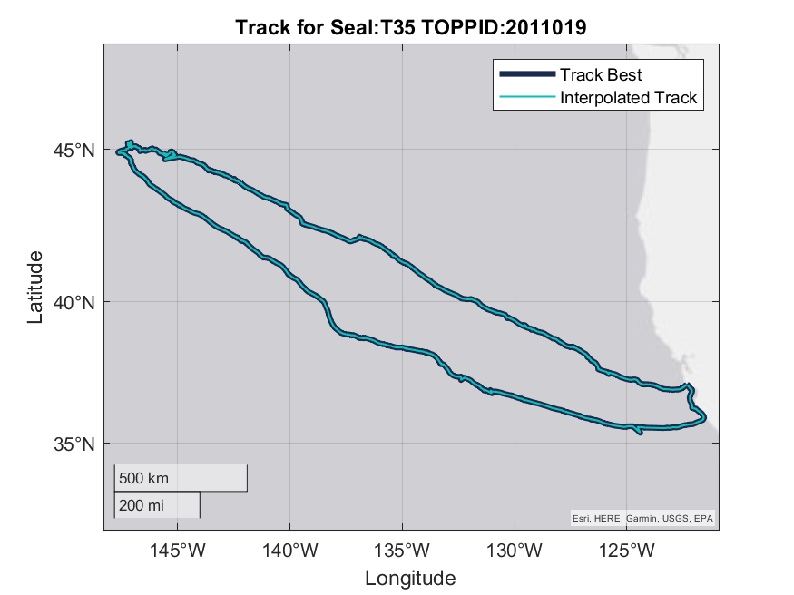
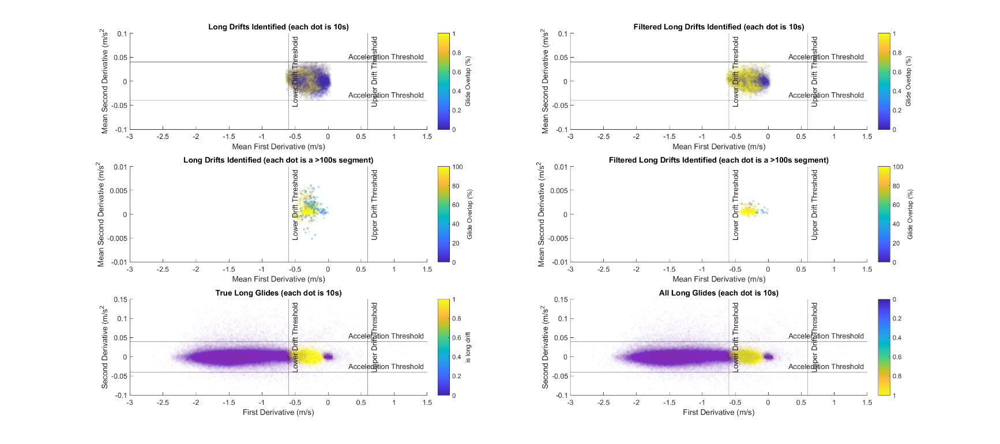

# **Sleep Study Protocol**

For more information on Data Analysis steps and current progress, see
GDrive 🗀 Sleep_Analysis \> 🗀 Scripts \> 00_Data_Analysis_Tracking.xlsx).
Generally, all scripts or settings files used to generate subsequent
data steps are in 🗀 Sleep_Analysis \> 🗀 Scripts and inputs/outputs for
each step are stored in 🗀 Sleep_Analysis \> 🗀 Data. To improve clarity
about which tools and filetypes are required and used by different
programs, we are using the following icons to represent different file
extensions:

-   Text file (.csv or .txt)
-    RStudio (.R script)
-    Excel (.xlsx worksheet)
-    BORIS Behavioral Program ([download
    here](https://boris.readthedocs.io/en/latest/))
-    Neurologger Software
-    EDF Browser ([download
    here](https://www.teuniz.net/edfbrowser/index.html))
-    LabChart (ADInstruments download here)
-    MATLAB v2020b 
    *  EEGLAB MATLAB toolbox
    for EEG research ([download here](https://eeglab.org/download/))  
    *  CATS MATLAB toolbox for
    Biologging tools ([download
    here](https://github.com/wgough/CATS-Methods-Materials))
-    ArcGIS Pro (ESRI)
-    Autodesk Maya

***Automated or manual review required:***

 Manual review required  
 Automated process  
  Semi-automated process

# Sleep Data Processing Pipeline

## [**STEP 00. Organize Metadata**](./00_Metadata)
   Metadata   and Video Scoring 

* **00.A.**   Notes  & Sleep_Study_Metadata 
* **00.B.**    Location Data Processing
* **00.C.**    Video Scoring  

## [**STEP 01. Convert Raw Data**](http://www.evolocus.com/neurologger-3.htm)
    Convert Raw Data. This step uses the [Neurologger Converter & Visualizer from Evolocus LLC](http://www.evolocus.com/neurologger-3.htm)

* **01.A.**     Download and convert data 
* **01.B.**  Rearrange EDF 
* **01.C.**   Visualize Raw Data in LabChart 
* **01.D.**   Raw Scoring 

## [**STEP 02. Process Motion Sensor Data**](./02_Processing-Motion-Env-Sensors)
    Processing Motion & Environmental Sensors 

*Scripts:* `02_ProcessingMotionEnvSensors.m` & [`CATS Toolbox`](https://github.com/wgough/CATS-Methods-Materials)

> Cade, D.E., Gough, W.T., Czapanskiy, M.F. et al. Tools for integrating inertial sensor data with video bio-loggers, including estimation of animal orientation, motion, and position. *Anim Biotelemetry* **9**, 34 (2021). https://doi.org/10.1186/s40317-021-00256-w

*Input:* Raw motion & environmental sensor data

* **02.A.**  [Read in Metadata]()
* **02.B.**  Load Motion & Environmental Data 
* **02.C.**  Resample Data
* **02.D.**  MAT File setup for CATS Toolbox
* **02.E.**    Run [`CATS Toolbox`](https://github.com/wgough/CATS-Methods-Materials)
* **02.F.**  Save Calibrated & Processed Data

## [**STEP 03. Pair Motion & Video Data (optional)**](./03_Video-Data-Analysis)
   Pairing Motion & Video Data 

* **03.A.**  Video Data Synchronization (if needed) 
* **03.B.**  Pairing Video Data to Motion Data 

## [**STEP 04. Behavioral Scoring Automation**](./04_Behavioral-Scoring-Automation)
  Behavioral Scoring Automation 

* **04.A.**  Main Process 

## [**STEP 05. ICA Processing for Electrophysiological Data**](./05_ICA-Processing)
   ICA Processing for Electrophysiological Data 

* **05.A.**   Load data into EEGLAB  
* **05.B.**  Subset Data  
* **05.C.**  Run ICA  
* **05.D.**  Inspect Results  
* **05.E.**  Apply ICA weights to whole dataset  
* **05.F.**  Export processed EDF 

## [**STEP 06. Qualitative Sleep Analysis**](./06_Sleep-Scoring)
 Manually scoring sleep data 

* **06.A.** Load data into LabChart 
* **06.B.** Identify scorable segments 
* **06.C.** Score Heart Rate (HR) Patterns 
* **06.D.** Score Sleep Patterns 

## [**STEP 07. Generate Hypnograms for Quantitative Sleep Analysis**](./07_Scored-Sleep-Analysis)
 Generating hypnograms (CSV with sleep state, respiratory state, and water code) for 5Hz, 1s, and 30s intervals. 

## [**STEP 08. 3D Track Generation & Visualization**](./08_3D-Track-Generation-and-Visualization)
  3D Track Generation   

* **08.A.**  Export Rates & Power from LabChart 
* **08.B.**  Export LabChart Calculations 
* **08.C.**  Estimate Speed from Processed Data 
* **08.D.**  Return to `CATS Toolbox` for Processing 
* **08.E.**  Review Track Generation 
* **08.F.**  Correct GPS points & rerun (if needed) 

## [**STEP 09. Hypnotrack Generation & Visualization**](./09_Hypnotrack-Generation-and-Visualization)
  Hypnotrack Visualizations   

* **09.A.**  Generate **hypnotrack** 
* **09.B.**  3D Sleep Maps in Arc GIS 
* **09.C.**   3D Sleep Animations in Maya 

## [**STEP 10. Data Aggregation & Standardization**](10_Data-Aggregation-and-Standardization)
 Reading in and standardizing depth data across datasets. 

* **00.** Load Data
* **01.** Process Data
    * **01.A.** Depth Correction
    * **01.B.** Data Truncation
    * **01.C.** Data Alignment
    * **Inputs:** MAT files, raw CSV dive data for Sleep, Kami/Stroke,
or TDR-only recordings.

## [**STEP 11. Sleep Estimates: estimating sleep across datasets**](11_Sleep-Estimates)

## [**STEP 12. Summarize all data**](12_Summary)
  Summarizing Sleep Scoring & Restimates Model Output 

*Script:* [`12_Summary.Rmd`]()

###  3D Track Generation   

###  Export Rates & Power from LabChart 

1.  **Overview:** Export 1Hz data on Heart Rate, Stroke Rate, and Delta
    EEG Power (L & R) data exported from LabChart.

    1.  **Script:**
         None; manual.

    2.  **Input:** **testNN_Nickname_05_ALL_PROCESSED_Trimmed.**adicht

    3.  **Output:
        testNN_Nickname_06_ALL_PROCESSED_Trimmed_withRATES_POWER.txt**
        **  
        **Exported LabChart Text File (downsampled 500X from original)
        

2.  **Verify ‘Heart_Rate’ & ‘Stroke_Rate’ channels are properly named
    (after ‘Pressure’)**

3.  **Create new channels:**

    1.  **L_EEG_Delta** (best L EEG channel spectral power calculation
        between 4 Hz & 0.5Hz)

    2.  **R_EEG_Delta** (best R EEG channel spectral power calculation
        between 4 Hz & 0.5Hz)

    3.  **HR_VLF_Power** (spectral power calculation between 0.005 Hz &
        0 Hz)

4.  **HR_VLF_Power** Spectrum settings:  
    

5.  **EEG_Delta** Spectrum settings:  
    

<!-- -->  

6.  **Export as LabChart text file with these settings (will save first
    column as Time of day in seconds):  
    **

###  Export LabChart Calculations 

7.  Open data pad 

8.  Delete all existing information from data pad

9.  Make sure that the best EEG channel is chosen for the EEG analysis

10.  Make the following changes/additions in Columns X, Y, Z

> 

1.  Change the Time Mode (by right-clicking in the timeline on the
    bottom of the Chart View in LabChart) to **“Show as time of day”**
    and **uncheck** Show time as seconds.

> 

10. Click on **Multiple Add to Data Pad** keeping the following settings
    –

> 

11. Wait while it generates the data

12. Copy paste all generated data onto a blank Excel file

13. Add columns for Seal_ID and Date_Time, format timestamps to
    ‘mm/dd/yyyy hh:mm:ss’

14. Save your data as:

###  Estimate speed from processed data 

1.  **Overview:** Use Processing Step 08.B in **08_Speed-Estimation.m**
     to estimate speed
    manually using 1Hz Stroke Rate data exported from LabChart and
    pitch, roll, heading.

    1.  **Script:**
        
        **08_Speed_Estimation.m** 

    2.  **Input:**
        **testNN_Nickname_06_ALL_PROCESSED_Trimmed_withRATES_POWER.txt**
        **  
        **Exported LabChart Text File (downsampled 500X from original)
        

    3.  **Outputs:** Speed vector to be used in CATS Processing

2.  Instructions:

###  Return to CATS Processing for 3D 

1.  **Overview:** Processing Step 02.H Return to Section 9 in CATS
    toolbox (should be able to re-import ‘…truncate.mat’ file and it
    will recognize your progress based on the ‘…Info.mat’ file.

    1.  **Script:**
        
        **MainCATSprhTool_JKB.m**

    2.  **Input:** Previous PRH .mat file, additional manual speed
        variable, and GPS hits spreadsheet
        

    3.  **Outputs:** Pseudotrack & Geo-referenced pseudotrack based on
        speed
        estimates

###  Review track generation 

2.  **Overview:** Manual inspection of the generated tracks in ArcGIS
    and/or Matlab. Remove and/or adjust inaccurate GPS points (making
    notes of any manipulation/justification in the “Notes” column).

    1.  **Script:**
        
        **MainCATSprhTool_JKB.m**  **& Review in Google
        Maps or ArcGIS**

    2.  **Input:** testNN_Nickname_GPShits.xlsx
         &
        testNN_Nickname_08_5HzgeoPtrackLatLong.csv
        

    3.  **Outputs:** testNN_Nickname_GPShits**\_UserModified**.xlsx
        

3.  **Instructions:**

    1.  Open generated track
        **testNN_Nickname_08_5HzgeoPtrackLatLong.csv** in ArcGIS Pro
        (drag & drop CSV into Contents panel).

    2.  Convert **XY Point Data**:  
        

    3.  **Drag & drop geoPtrack CSV** from Contents panel to “Input
        Table” field.  
        

    4.  Press “Run”

    5.  Click on a point to see what time it was recorded at. Use ArcGIS
        or Google Maps to re-associate that point in time to a more
        accurate GPS point based on animal observations or landmasses
        (nearest coastal interface for inland points).

###  Rerun with corrected GPS points 

4.  **Overview:** Re-run section 13b and import corrected GPS points to
    re-generate track.

    1.  **Script:**
        
        **MainCATSprhTool_JKB.m**

    2.  **Input:** Previous PRH .mat file, additional manual speed
        variable, and corrected GPS hits spreadsheet:
        testNN_Nickname_GPShits**\_UserModified**.xlsx
        

    3.  **Outputs:
        testNN_Nickname_08_5HzgeoPtrackLatLong_manualspeed_manualGPScorrection.csv**
        

> Pseudotrack & Geo-referenced pseudotrack based on speed estimates

###  Hypnotrack Visualizations   

###  Generate Hypnotrack 

1.  **Overview:** Processing Step 09.A; After generating a pseudotrack
    and geo-referenced pseudotrack, you are ready to link sleep and
    motion data to a 3D track to visualize and interpret.

    1.  **Script:**
        
        **09_Hypnotracks.m**

    2.  **Inputs:**

        1.  **Motion Data:** testNN_Nickname_08_PRH_file_5Hzprh.mat

        2.  **Hypnogram:** testNN_Nickname_06_Hypnogram_JKB_5Hz.csv

        3.  LatLongs:

        4.  Ptrack & geoPtrack variables from CATS Processing
            

    3.  **Outputs:** CSV with Ptrack & geoPtrack variables to be matched
        with hypnogram data later on.

        1.  **Rename output:**
            testNN_Nickname_1HzgeoPtrackLatLong_manualspeed_manualGPScorrection.csv

            1.  Rename with ‘\_manualspeed’ if speed was calculated
                based on stroke rate manually.

            2.  Rename with ‘\_manualGPScorrection’ if GPS positions
                were checked and eliminated or adjusted to fit the
                contour of the coast manually

        2.  **Rename output:**

            1.  Make copy of prh mat file and rename:
                “testNN_Nickname_08_PRH_file_5Hzprh.mat”

###  3D Sleep Maps in ArcGIS 

1.  **Overview:** Import CSV; transform XY table to Point (with Z field
    = Depth); style based on categorical sleep variable; enable time and
    export as 3D animation if desired.

    1.  **Script:** none; manual.

    2.  **Input:** 1Hz hypnotrack file.

    3.  **Outputs:** 3D maps (pngs).

###  3D Sleep Animations in Maya 

2.  **Overview:** Follow [Visualizing Life in the Deep
    animation/visualization
    pipeline](https://github.com/jmkendallbar/VisualizingLifeintheDeep)
    to visualize underwater behavior and physiology.

    1.  **Scripts:** Github repository:
        <https://github.com/jmkendallbar/VisualizingLifeintheDeep>

    2.  **Input:** 25Hz, 5Hz, and 1Hz hypnotrack data.

    3.  **Outputs:** 3D animations (mp4s).

    4. **Instructions:** Prepare 10Hz data for importing into Maya:
            1. **GLIDE CONTROLLER:** Create new channel with arithmetric: `Smooth(Window(Ch18,0,15),15)` This applies a smoothing filter of 15 seconds and sets any value between a stroke rate of 0 and 15 strokes per minute to 1 (GLIDE) and any stroke rates above 15 strokes per minute to 0 (SWIM).
            2. **SWIM CONTROLLER:** Cyclic measurement that uses GyrZ channel with Smoothing = 100 ms; Median filtering with a window of 3 pts; High-pass cutoff: 0.3Hz; Auto-leveling/normalization window of 3s and 0.1 rps; Minimum peak height: 0.15; minimum period 500 ms; peak search window: 30s
            3. **EXPORT:** Generate .txt file :
            

###  Data Aggregation & Standardization  

###  Generate standardized raw files

1.  **Overview:** Create standardized raw data files for kami kami and
    stroke raw data to be used in Costa lab elephant seal dive analysis
    pipeline.

    1.  **Script:**
        
        ***10_Merge-Stroke-Kami-Data.m***
        

    2.  **Input:** raw Kami & Stroke text files

    3.  **Outputs:** Raw data CSVs to be used in our dive analysis
        pipeline.

31. ###  Sleep Estimates: quantifying measures of behavioral sleep 

    1.  **Overview:** Estimate sleep time for northern elephant seals
        based on behavioral estimates of rest (cessation of stroking and
        flattening of vertical speed).

        1.  **Script:**
            
            ***11_Restimates.m*** 

        2.  **Inputs:** MAT files, raw CSV dive data for Sleep,
            Kami/Stroke, or TDR-only recordings.

        3.  **Outputs:** Behavioral Restimates! Images & CSVs:

<!-- -->

1.  ###  Load Data

    1.  **Overview:**

        1.  Loads in and previews data.

        2.  **Loads** in and previews EEG data

        3.  **Check timestamps** are continuous

        4.  **Down-samples 1Hz data** to sampling interval = 10s.

        5.  **Standardize resolution** of pressure sensor (ours is more
            sensitive than typical depth sensors used in adult female
            deployments, so we rounded to the nearest meter)

    2.  **Inputs:** MAT files, raw CSV dive data for Sleep, Kami/Stroke,
        or TDR-only recordings.

        1.  ***Sleep Data:  
            **SealID_09_sleep_raw_data_Hypnotrack_JKB_1Hz.csv*
            
            *(SealID: testNN_Nickname)*

        2.  ***Stroke Data:  
            **SealID_stroke_raw_data.csv*
            
            *(SealID example: 2012-PM_X106 post-molt trip)*

        3.  ***Dive Data:**  
            SealID_iknos_raw_data.csv (SealID example: varied)*

        <!-- -->

        1.  **Outputs:** Preview images & NewRaw
            

2.  ###  Process Depth Data 

    1.  ### **Depth Correction**

        1.  **Overview:** Corrects depth data for uncorrected Stroke
            data, other dive data is already zero-offset corrected using
            IKNOS dive analysis package.

            1.  Find surface intervals:

                1.  Look for consecutive sections where the first
                    derivative \< 0.1 m/s

                2.  Filter out chunks where median depth is more than 40
                    (finds likely surface intervals)

            2.  Place this depth recorded during shallow flat chunks in
                NewRaw.DepthCorrection in the original dataset.

            3.  Use this depth correction to adjust depth values.

        1.  **Inputs:** Uncorrected StrokeRaw.CorrectedDepth
            

        2.  **Outputs:** Corrected StrokeRaw.CorrectedDepth
            

        3.  **Instructions:** If you like the depth correction, run the
            next section. If not, adjust settings or inspect variables.

    2.  ### **Data Truncation**

        1.  **Overview:** Removes (sometimes very long) flat sections
            before and after diving data using corrected depth data and
            removing long flat chunks at beginning and end of the
            recording. Creates a list of flat chunks (combines potential
            dives and surface intervals because sometimes depth sensor
            will hang on a large positive or negative value). This step
            also generates a list of potential dives with which to
            perform data alignment (next step).

            1.  Find potential dives / surface intervals:

                1.  Look for consecutive sections where the depth \< or
                    \> 2 meters

                2.  Generate stats for potential dives & potential
                    surface intervals

            2.  Concatenate potential dives / surface intervals (to find
                longest last one whether recognized as a dive or a
                surface interval).

            3.  Truncate data by removing the first and last chunk of
                flat data. Include 1000 samples on either side to avoid
                truncating data.

            4.  Inspect results.

        <!-- -->

        1.  **Inputs:** Untruncated StrokeRaw
            

        2.  **Outputs:** Truncated StrokeRaw
            

        3.  **Instructions:** If you like the truncation, run the next
            section. If not, adjust settings or inspect variables.

    3.  ### **Data Alignment**

        1.  **Overview:** Attempts to find the potential offset between
            NewRaw (mk10 dive data) and StrokeRaw (Kami/Stroke loggers)
            by matching up the time of the second deepest dive in the
            first 50 dives. We used second deepest dive to avoid
            occasional.

            1.  Find potential dives / surface intervals:

                1.  Look for consecutive sections where the depth \< or
                    \> 2 meters

                2.  Generate stats for potential dives & potential
                    surface intervals

            2.  Concatenate potential dives / surface intervals (to find
                longest last one whether recognized as a dive or a
                surface interval).

            3.  Truncate data by removing the first and last chunk of
                flat data. Include 1000 samples on either side to avoid
                truncating data.

            4.  Inspect results.

        <!-- -->

        1.  **Inputs:** Untruncated StrokeRaw
            

        2.  **Outputs:** Truncated StrokeRaw
            

        3.  **Instructions:** If you like the depth correction, run the
            next section. If not, adjust settings or inspect variables.

    4.  ### **Inputs:** MAT files, raw CSV dive data for Sleep, Kami/Stroke, or TDR-only recordings.

        1.  ***Sleep Data:  
            **SealID_09_sleep_raw_data_Hypnotrack_JKB_1Hz.csv*
            
            *(SealID: testNN_Nickname)*

        2.  ***Stroke Data:  
            **SealID_stroke_raw_data.csv*
            
            *(SealID example: 2012-PM_X106 post-molt trip)*

        3.  ***Dive Data:**  
            SealID_iknos_raw_data.csv (SealID example: varied)*

        <!-- -->

        1.  **Outputs:** Preview images & NewRaw
            

            1.  TOPPID_SEALID_00\_**Dive-Example.png**

            2.  TOPPID_SEALID_00\_**Track.png  
                > ***Snapshots of diving data and track allow a quick
                > assessment of whether raw diving data is aligned with
                > MAT files. If diving data is not aligned with MAT
                > file, a 0 will be placed in
                > **Seals_Used.Dive_data_aligned_with_MAT_file(k).***

            3.  TOPPID_SEALID_01\_**StrokeRaw-NewRaw_Alignment-Check.png**

            4.  TOPPID_SEALID_02\_**Dive-Smooth.png**

            5.  TOPPID_SEALID_03\_**Drift-Dive-Output.png**

            6.  TOPPID_SEALID_03\_**Drift-Dive-Ouput_Trip-percent-NNN_24h.png**

            7.  TOPPID_SEALID_03\_**Drift-Dive-Stats.png**

            1.  Summary Statistics:

                1.  TOPPID_SEALID_10\_**Daily Stats.csv**

                2.  TOPPID_SEALID_10\_**Dive Stats.csv**

                3.  TOPPID_SEALID_10\_**Drifts_with_Stats.csv**

                4.  TOPPID_SEALID_10\_**SleepStats.csv**

> 

5.  TOPPID_SEALID_03\_**Drift-Rate-Smoothed.png**

###  Load Data

### Appendix: Additional Sleep Scoring Examples

CALM \> SWS1 \> SWS2 example

CALM \> SWS1 \> REM1 example

1.  (add sleep spindle example)

2.  <https://docs.google.com/spreadsheets/d/1ZG0uv0oxD3FXibsADBd3E5qt3RTyfqIA/edit#gid=639986253>

3.  

# Seal Sleep Analysis
 Code for my dissertation research on sleep in seals.

## Data Processing Pipeline:

### **00 Metadata**: manually entered
Input data:

1. **00_Sleep_Study_Metadata.xlsx** - Metadata for all studies
2. **00_Ethogram.xlsx** - Ethograms
3. testNN_Nickname_**00_Notes.xlsx** - Original data entered in Excel
4. testNN_Nickname_**00_VideoScoringData** - Video Scoring Data

Scripts:

1. **00_Metadata.Rmd** - R code to parse metadata and format

Output Data: 

1. **01_Sleep_Study_Metadata.csv** - Long format metadata for all animals
2. testNN_Nickname_**00_Metadata.csv** - Metadata for single animal

### 01 Raw data: data from Neurologger and converter/visualizer

Data:

1. testNN_Nickname_**01_ALL.dat** - Binary data straight from the tag
2. testNN_Nickname_**01_ALL.mat** - Converted MATLAB file with all data
3. testNN_Nickname_**01_ALL.edf** - Converted EDF file with all data
4. testNN_Nickname_**01_GyroAccelCompass.csv** - Inertial Motion Sensor and Environmental Sensor Data
5. testNN_Nickname_**01_ResetDelaysTimeDuration.csv** - Logger restart timepoints and durations
6. testNN_Nickname_**01_MK10_ID.wch** - MK10 Tag data (only for wild animals)
7. testNN_Nickname_**01_MK10_ID_decoded.csv** - MK10 Decoded Tag data (only for wild animals)

### 02 Inertial Motion Sensor Processing

Scripts:

1. **02_ProcessingMotionEnvSensors.m** - Applying calibration to get pitch, roll, heading, and ODBA

Output data: Inertial Motion Sensor (Accel, Gyro, Compass) and Environmental Sensor Data (Pressure, Temperature, Illumination)
with processed IMU data (pitch, roll, heading, position, ODBA, etc)

1. testNN_Nickname_**02_Calibrated_Processed_MotionEnvSensors_10Hz.csv** - Calibrated and processed at 10Hz
2. testNN_Nickname_**02_Calibrated_Processed_MotionEnvSensors_10Hz.mat** - Calibrated and processed at 10Hz
3. testNN_Nickname_**02_Calibrated_Processed_MotionEnvSensors_25Hz.csv** - Calibrated and processed at 25Hz
4. testNN_Nickname_**02_Calibrated_Processed_MotionEnvSensors_25Hz.mat** - Calibrated and processed at 25Hz

### 03 Behavior and Video: Pairing Motion and Environmental Sensor Data to Video Scoring Data

Scripts:

1. **03_Motion Data and Video Analysis.Rmd**

Output data: Pairing video scoring data to motion and environmental sensors

1. testNN_Nickname_**03_VideoMotionData_25Hz.csv** - Video scoring data paired to motion and environmental sensing data.

### 04 Behavioral Analysis and Automation

Script:

1. **04_Behavioral_Scoring_Automation.py**

### 05 Sleep Scoring

Scripts:

1. **05_EEG_PreProcessing.py** - Script to compile, clean, discretize, and process EDF files. 
2. **05_MakeEEGLABfile.m** - Converts MATLAB file to EEGLAB file for processing (resamples and reshapes .mat array and labels channels)
3. **05_ICA_Automation.m** - This script automates running ICA on subsamples of EEG data.
4. **05_ICA_Model_Runs.xlsx** - Use this spreadsheet to keep track of outputs of ICA Model Runs.

Input data: 

1. testNN_Nickname_**Processed_ALL.edf** - NEED TO make these still
2. testNN_Nickname_**05_Scoring_Land_ALL.edf** - Processed EDFs for sleep scoring
3. testNN_Nickname_**05_Scoring_Water_ALL.edf** - 

Scoring performed in LabChart

Output data:

1. testNN_Nickname_**05_Scoring_ALL.adicht** - Scored data in LabChart
2. testNN_Nickname_ 

### 06 Quantitative Sleep Analysis

Scripts:

1. **06_Sleep_Scoring_Figures.py** - PYTHON Script to make figures with data scored in LabChart.
2. **06_Hypnograms.Rmd** - R script to create hypnogram and related figures.
3. **06_Sleep_Scoring_Figures.Rmd** - R script to create sleep summary plots comparing stages in R.

### 07 Sleep Scoring Automation

Scripts:

1. **staging.py** - staging script to alter from YASA in yasa_seals directory

